# A Survey of Large Language Models

- [A Survey of Large Language Models](#a-survey-of-large-language-models)
  - [1. INTRODUCTION](#1-introduction)
  - [2. OVERVIEW](#2-overview)
    - [2.1 LLMs的背景](#21-llms的背景)
      - [比例定律（Scaling Laws）](#比例定律scaling-laws)
      - [涌现能力（Emergent Abilities）](#涌现能力emergent-abilities)
      - [关键技术（Key Techniques）](#关键技术key-techniques)
    - [2.2 GPT系列模型的技术演进](#22-gpt系列模型的技术演进)
      - [早期探索](#早期探索)
      - [容量飞跃](#容量飞跃)
      - [能力提升](#能力提升)
      - [语言模型里程碑](#语言模型里程碑)
  - [3. LLM资源](#3-llm资源)
    - [3.1 公开可获取的模型或API](#31-公开可获取的模型或api)
      - [10B级别的模型](#10b级别的模型)
      - [100B级别的模型](#100b级别的模型)
      - [LLM的公开API](#llm的公开api)
    - [3.2 常用语料](#32-常用语料)
      - [Books](#books)
      - [CommonCrawl](#commoncrawl)
      - [Reddit Links](#reddit-links)
      - [Wikipedia](#wikipedia)
      - [Code](#code)
      - [其他](#其他)
    - [3.3 库资源](#33-库资源)
      - [Transformers](#transformers)
      - [DeepSpeed](#deepspeed)
      - [Megatron-LM](#megatron-lm)
      - [JAX](#jax)
      - [Colossal-AI](#colossal-ai)
      - [BMTrain](#bmtrain)
      - [FastMoE](#fastmoe)
  - [4. 预训练](#4-预训练)
    - [4.1 数据收集](#41-数据收集)
      - [4.1.1 数据源](#411-数据源)
      - [4.1.2 数据处理](#412-数据处理)
      - [4.1.3 预训练数据对LLM的影响](#413-预训练数据对llm的影响)
    - [4.2 架构](#42-架构)
      - [4.2.1 主流架构](#421-主流架构)
      - [4.2.2 详细配置](#422-详细配置)
      - [4.2.3 预训练任务](#423-预训练任务)
      - [4.2.4 总结和讨论](#424-总结和讨论)
    - [4.3 模型训练](#43-模型训练)
      - [4.3.1 优化设置](#431-优化设置)
      - [4.3.2 可扩展训练技术](#432-可扩展训练技术)
  - [5. 自适应调整](#5-自适应调整)
    - [5.1 指令调整](#51-指令调整)
      - [5.1.1 格式化实例构建](#511-格式化实例构建)
      - [5.1.2 指令调整策略](#512-指令调整策略)
      - [5.1.3 指令调整的影响](#513-指令调整的影响)
    - [5.2 对齐调整](#52-对齐调整)
      - [5.2.1 对齐的背景和标准](#521-对齐的背景和标准)
      - [5.2.2 收集人类反馈](#522-收集人类反馈)
      - [5.2.3 从人类反馈中强化学习](#523-从人类反馈中强化学习)
    - [5.3 高效调整（Efficient Tuning）](#53-高效调整efficient-tuning)
      - [5.3.1 参数高效微调方法](#531-参数高效微调方法)
        - [Adapter Tuning](#adapter-tuning)
        - [Prefix Tuning](#prefix-tuning)
        - [Prompt Tuning](#prompt-tuning)
        - [Low-Rank Adaptation（LoRA）](#low-rank-adaptationlora)
      - [5.3.2 LLM的参数高效微调](#532-llm的参数高效微调)
  - [6. 应用](#6-应用)
    - [6.1 情境学习（In-Context Learning）](#61-情境学习in-context-learning)
      - [6.1.1 提示词公式（Prompting Formulation）](#611-提示词公式prompting-formulation)
      - [6.1.2 示范设计（Demonstration Design）](#612-示范设计demonstration-design)
      - [6.1.3 底层机制](#613-底层机制)
    - [6.2 思维链（Chain-of-Thought）](#62-思维链chain-of-thought)
      - [6.2.1 使用CoT进行情境学习](#621-使用cot进行情境学习)
      - [6.2.2 CoT的更多讨论](#622-cot的更多讨论)
  - [7. 能力评估](#7-能力评估)
    - [7.1 基础评价任务](#71-基础评价任务)
      - [7.1.1 语言生成](#711-语言生成)
      - [7.1.2 知识运用](#712-知识运用)
      - [7.1.3 复杂推理](#713-复杂推理)
    - [7.2 进阶能力评估](#72-进阶能力评估)
      - [7.2.1 人类对齐](#721-人类对齐)
      - [7.2.2 与外界环境交互](#722-与外界环境交互)
      - [7.2.3 操作工具](#723-操作工具)
    - [7.3 公共基准与实证分析](#73-公共基准与实证分析)
      - [7.3.1 评估基准](#731-评估基准)
      - [7.3.2 LLM的综合能力分析](#732-llm的综合能力分析)
  - [8. 总结和展望](#8-总结和展望)
      - [理论与原则](#理论与原则)
      - [模型架构](#模型架构)
      - [模型训练](#模型训练)
      - [模型应用](#模型应用)
      - [安全性和对齐](#安全性和对齐)
      - [应用和生态系统](#应用和生态系统)

这篇综述发表于2023年4月28日，作者主要来自中国人民大学。

文章从四个方面来介绍LLM，包括pre-training，adaptation tuning，utilization 和 capacity evaluation。也总结了一些开发LLM的资源，并讨论未来值得研究的遗留问题。

文章官方git如下：[LLMSurvey](https://github.com/RUCAIBox/LLMSurvey)

## 1. INTRODUCTION

语言模型（LM）是提高机器智能的主要方法。可以分为四个发展阶段：

* Statistical language models (SLM)：统计语言模型。例如n-gram语言模型。SLM会有维度灾难问题。

* Neural language models (NLM)：神经语言模型。例如RNN、word2vec。word2vec通过浅层神经网络来学习分布式词表征。这些研究初步使用语言模型进行表征学习，对NLP领域发展有重要影响。

* Pre-trained language models (PLM)：预训练语言模型。例如ELMo，Bert。确定了pre-training和fine-tuning的范式。

* Large language models (LLM)：大语言模型。根据[scaling laws](https://arxiv.org/pdf/2001.08361.pdf)，扩大模型或增加数据可以提高下游任务的模型能力。虽然模型架构和预训练任务比较类似，但是大模型表现出惊人的能力（一般称为涌现现象，但是斯坦福有[论文](https://arxiv.org/pdf/2304.15004.pdf)提出涌现只是度量选择的结果）。

文章针对LLM所讲的四个方面具体如下：

* pre-training：预训练。

* adaptation-tuning：自适应调整。调整LLM的有效性和安全性。

* utilization：应用。如何利用LLM解决各种下游任务。

* capability evaluation：能力评估。如何通过现有实验评估LLM的能力。

## 2. OVERVIEW

### 2.1 LLM的背景

#### 缩放定律（Scaling Laws）
LLM的架构和预训练目标与小模型类似，研究表明缩放可以很大程度上提高LLM的模型能力。因此建立定量方法来表征缩放的影响是很有用的。这里介绍两个对Transformer语言模型的代表性缩放定律：

* KM scaling law
这是2020年OpenAI的一篇论文，名字来源于两个一作的首字母。
他们首次提出针对三个主要因素对模型性能的幂律关系进行建模，即模型大小（N）、数据集大小（D）、训练计算量（C）。给定计算预算 c，他们凭经验提出了缩放定律的三个基本公式：
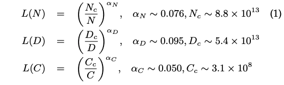

其中L(·)代表交叉熵损失。这三个定律是通过用不同数据大小（22M至23B个token）、模型大小（768M至1.5B非embedding参数）和训练计算量，在一些假设（例如，一个因素不能被另外两个因素限制）下拟合模型性能得到的。

* [Chinchilla scaling law](https://arxiv.org/pdf/2203.15556v1.pdf)  
参考：[知乎-Chinchilla](https://zhuanlan.zhihu.com/p/606038646)  
谷歌DeepMind团队做了范围更广的实验，模型大小从70M到16B，数据大小从5B到500B个token，得到了类似的公式：

这两篇的结论有所不同：给定10倍的计算预算，KM scaling law建议模型尺寸应该增加5.5倍，而训练的tokens数量应该增加1.8倍。相反，Chinchilla发现模型的尺寸和训练的tokens应该等比例的增加。

#### 涌现能力（Emergent Abilities）  
涌现能力一般定义为“小模型没有而在大模型中出现的能力”。简单介绍三种典型LLM的涌现能力以及代表模型。

* 情境学习（ICL）  
给语言模型一些自然语言指令和任务描述，在无需训练和梯度更新的情况下，它可以通过补全输入文本序列来得期望的输出。GPT-3展示出很强的ICL能力，而GPT-1和GPT-2没有。当然这个能力也和取决于具体下游任务。例如13B GPT-3已经在算数任务上有了ICL能力，而175B GPT-3甚至在波斯语QA任务上表现不好。
* 指令跟随  
通过instruction tuning，LLM可以在没见过的任务上表现良好。但是这种能力也只在模型大小达到一定量级才会出现。
* 逐步推理  
通过思维链（CoT）prompt策略，LLM可以通过涉及中间推理步骤的prompt机制解决数学推理问题，得出最终答案。这种能力据推测来源于训练数据中的代码。

#### 关键技术（Key Techniques）
* 缩放（Scaling）  
更大的模型、数据量和更多的训练计算量可以提升模型能力。一般计算经费是有限的，可以通过scaling law来更高效地分配计算资源。例如Chinchilla通过增加数据量、减小模型大小，在计算资源相同情况下，效果超过了Gopher。
* 训练（Training）  
分布式训练算法。业界发布了一些方便使用并行算法的框架，如DeepSpeed、Megatron-LM。
* 激发能力（Ability eliciting）  
经过大量语料的训练，LLM有了解决通用任务的潜在能力。在有些任务上这些能力并没有展示出来，需要通过设计指令或者特定的ICL策略来激发这些能力。例如CoT prompt可以通过包括中间过程来解决复杂推理问题。
* 对齐调整  
LLM可能产生有毒的、偏见的、有害的内容。有必要将LLM与人类价值观对齐，例如有用性、真实性、无害性。InstructGPT使用“基于人类反馈的强化学习（RLHF）”来解决这个问题。ChatGPT与之类似，展示了很强的对齐能力，可以产生高质量、无害回复。
* 操作工具  
LLM不擅长数字计算，而且限制于训练数据，不能获取最新信息。最新技术通过使用外部工具来解决这个问题。例如通过计算器来精确计算、通过使用搜索引擎来获取未知信息。LLM操作外部插件的应用也逐渐变多。

### 2.2 GPT系列模型的技术演进

#### 早期探索
* GPT-1。2017年谷歌推出Transformer，OpenAI基于这个新架构在2018发布了GPT-1。GPT-1是一个基于生成式的、decoder-only的Transformer架构，采用无监督预训练和有监督fine-tune的混合模式。GPT-1已经为GPT系列模型建立了核心架构，并建立了对自然语言文本建模的基本原理，即预测下一个词。
* GPT-2。基于类似于GPT-1的架构，GPT-2增加参数量到1.5B，使用网页数据WebText来训练。它可以在未经有标签数据fine-tune的情况下，通过无监督语言模型来完成一些任务。“由于（特定任务的）有监督目标与无监督（语言建模）目标相同，只是在序列的子集上进行评估，因此无监督目标的全局最小值也是有监督目标的全局最小值（适用于各种任务）。”这个主张的基本理解是，每个（自然语言处理）任务都可以被视为基于语料库的一个子集进行的词语预测问题。因此，如果无监督语言建模被训练得具备足够的能力来恢复语料库，它就有可能在解决各种任务上发挥作用。

#### 能力飞跃
虽然GPT-2有一定能力作为无监督多任务学习器，但是相比有监督sota还是差一些。基于GPT-2，GPT-3通过扩展生成式预训练架构实现关键的能力飞跃。

* GPT-3。2020年发布，模型参数175B。GPT-3论文正式介绍了情境学习（ICL），它通过few-shot或zero-shot的方式使用LLM。这样预训练和预测的任务得到了统一。GPT-3不仅在各种自然语言处理（NLP）任务中展现出非常出色的性能，还在一些特别设计的需要推理或领域适应能力的任务上表现出色。总体而言，GPT-3可以被视为从预训练语言模型（PLM）发展到大型语言模型（LLM）过程中的一个重要里程碑。它通过实证证明，将神经网络规模扩大到相当大的程度可以显著增加模型的能力。

#### 能力提升
OpenAI探索了两个进一步提升GPT-3能力的主要方法，在代码数据上训练和与人类对齐

* 在代码数据上训练
GPT-3的主要缺陷是在复杂任务上缺乏推理能力，例如补全代码和解决数学问题。2021年7月，OpenAI提出了Codex，一个利用GitHub代码训练的GPT模型。2022年1月，提出了一个训练文本和代码embedding的对比学习方法。GPT-3.5基于code-based GPT模型（code-davinci-002）发展而来，这说明在代码数据上训练是提升模型能力的很好的方法。并且基于代码数据训练可以提升LLM的CoT能力。
* 与人类对齐  
2017年OpenAI发布了名为“learning from human preferences”的博客，利用强化学习从人类标注的偏好比较中学习。2017年7月，Proximal Policy Optimization（PPO，近端策略优化）算法发布，目前它已经是从人类偏好中学习的基础RL算法。2020年1月，利用上述RL算法对GPT-2微调，利用人类偏好提升其在NLP任务上的能力。2022年1月，提出InstructGPT，正式建立了三阶段的RLHF算法。

#### 语言模型里程碑
* ChatGPT。2022年11月，OpenAI发布ChatGPT。它与InstructGPT训练方法类似，特别在对话方面做了优化。ChatGPT的推出对未来人工智能研究产生了重大影响，为探索类人人工智能系统提供了思路
* GPT-4。扩展为多模态输入。GPT-4对恶意或挑衅性查询的回应更加安全，这是因为它经过了为期六个月的迭代调整（在RLHF训练中还加入了额外的安全奖励信号）。另外，GPT-4是基于一个成熟的深度学习基础架构开发的，并采用了改进的优化方法。他们引入了一种名为"可预测的缩放"的新机制，在模型训练过程中可以用较少的计算量准确预测最终的性能。  
尽管取得了巨大进步，但是LLM仍然存在问题，例如GPT-4生成的内容可能存在虚假错误或潜在风险的回应。

## 3. LLM资源

### 3.1 公开可获取的模型或API

#### 10B级别的模型
这部分介绍的大部分参数都在10B到20B之间，除了LLaMA（最大版本65B参数）和NLLB（最大版本54.5B参数）。这个范围的其他模型包括**mT5、PanGu-\alpha、T0、GPT-NeoX-20B、CodeGen、UL2、Flan-T5和mT0**。其中，Flan-T5（11B版本）可以作为研究instruction tuning的首选模型，因为它从多个方面探索了instruction tuning：增加任务数量、扩展模型大小、使用思维链提示数据做fine-tune。除此之外，CodeGen（11B版本），作为一个设计用来生成代码的自回归语言模型，可以作为探索代码生成能力的很好的候选。它还引入了一个新的基准 MTPB，专门用于多轮代码合成，由 115 个专家生成的问题组成。为了解决这些问题，需要LLM获取足够的编程知识（如，数学、array操作和算法）。至于多语言任务，mT0（13B版本）可以作为一个很好的候选模型，它使用多语言任务和多语言prompt做了fine-tine。此外，PanGu-\alpha在中文下游任务的zero-shot和few-shot设定下表现良好，它基于深度学习框架MindSpore开发。注意PanGu-\alpha有多个版本，最高200B参数，开源的最多有13B参数。作为更新的版本，LLaMA（65B版本），大概有5位于其他模型的参数量，已经在指令跟随方面的任务展现出更好的效果。  
通常，在这个量级预训练模型成百上千的GPU或TPU。例如，GPT-NeoX-20B用了12个超微服务器，每个配备了8个NVIDIA A100-SXM4-40GB GPU，而LLaMA使用了2048个A100-80G GPU。为了更精确估计所需的计算资源，建议使用衡量所涉及计算数量的指标，例如FLOPS（即每秒浮点数操作）。

#### 100B级别的模型
这个类别的模型只有少数开源。例如，OPT、OPT-IML、BLOOM、BLOOMZ与GPT-3（175B版本）参数量差不多，而GLM和Galactica分别有130B和120B参数。其中，OPT（175B版本）专门用于开放共享，旨在使研究人员能够大规模开展可重复的研究。BLOOM（176B版本）和BLOOMZ（176B版本）得益于其在多语言建模任务的能力，可以作为跨语言生成研究的基础模型。在这些模型中，OPT-IML用指令调整过，可以作为研究指令调整的很好候选。这个级别的模型通常需要上千GPU或TPU来训练。例如，OPT（175B版本）用了992个A100-80GB GPU，而GLM（130B版本）用了96个节点的NVIDIA DGX-A100（8*40G）GPU集群。

#### LLM的公开API
OpenAI提供了7个GPT-3系列的模型：ada、babbage、curie、davinci、text-data-001、text-babbage-001和text-curie-001。其中前四个接口可以在OpenAI的主机服务器上继续fine-tune。特别的，babbage、curie和davinci分别对应GPT-3（1B）、GPT-3（6.7B）和GPT-3（175B）模型。此外，还有两个关于Codex的API，叫code-cushman-001（一个强大的多语言版本Codex（12B））和code-davinci-002。此外，GPT-3.5系列包括一个基础模型code-davinci-002和三个增强版本，叫做text-davinci-002、text-davinci-003和gpt-3.5-turbo-0301。最近，OpenAI又发布了GPT-4对应的API，包括gpt-4、 gpt-4-0314、 gpt-4-32k和gpt-4-32k-0314。

### 3.2 常用语料
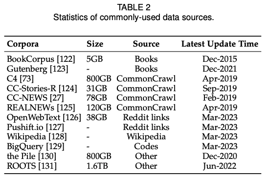
#### Books
BookCorpus，包含11,000本书，涵盖广泛的主题和类型（如，小说和自传）。
Gutenbert项目，由 70,000 多本文学书籍组成，包括小说、散文、诗歌、戏剧、历史、科学、哲学和其他类型的公共领域作品。GPT-3所使用的Books1和Books2，比BookCorpus大很多，但是没有公开发布。

#### CommonCrawl
CommonCrawl是从网络抓取的数据集。有四个常用的语料：C4、CC-Stories、CC-News和RealNews。Colossal Clean Crawled Corpus（C4）包括5个变体，分别是en（806G）、en.noclean（6T）、realnewslike（36G）、webtextlike（17G）和multilingual（38T）。en版本用来预训练T5、LaMDA、Gopher和UL2。多语言C4，也叫MC4，被用来训练mT5。CC-Stories（33G）是CommonCrawl数据的一个子集，它的内容用类似故事的方式制作。原始版本的CC-Stories无法使用，所以table 2介绍了CC-Stories-R。另外，两个从CommonCrawl摘取的新闻数据集RealNews（120G）和CC-News（76G）也经常被用来预训练。

#### Reddit Links
WebText是一个由高赞Reddit链接数据构成的著名数据集，但是没有公开。作为替代，有一个可以获取到开源版本叫OpenWebText。另一个从Reddit摘取的数据集叫PushShift.io，一个实时更新的数据集，由 Reddit 自创建之日起的历史数据组成。

#### Wikipedia
Wikipedia是一个在线的百科全书，包含各个主题的大量高质量文章。这些文章中的大多数都是以说明文的写作风格（带有支持性参考文献）撰写的，涵盖了广泛的语言和领域。 通常，仅英语过滤版本的维基百科被广泛用于大多数 LLM（例如，GPT-3、LaMDA 和 LLaMA）。 维基百科有多种语言版本，因此可以在多语言环境中使用。

#### Code
两个主要来源是开源代码仓库（GitHub）和代码相关的问答平台（StackOverflow）。谷歌公开发布了BigQuery数据库，包括各种语言的大量开源代码片段，作为代表性代码数据集。CodeGen使用了BIGQUERY，一个BigQuery的子集，来训练多语言版本的CodeGen（CodeGen-Multi）。

#### 其他
Pile是一个大规模、多样化和开源的文本数据集，包含来自多个来源的超过 800GB 的数据，包括书籍、网站、代码、科学论文和社交媒体平台。此外，ROOTS由各种较小的数据集（总共 1.61 TB 的文本）组成，涵盖 59 种不同的语言（包括自然语言和编程语言），被用来训练BLOOM。

介绍3个有代表性的LLM所使用的预训练数据集：

* GPT-3（175B）在300B个token的混合数据上训练，包括CommonCrawl、WebText2、Books1、Books2和Wikipedia。
* PaLM（540B）使用780B个token的预训练数据，包括社交媒体对话、过滤的网页、书、Github、多语言Wikipedia和新闻。
* LLaMA从各种来源提取训练集，包括CommonCrawl、C4、GitHub、Wikipedia、books、ArXiv和StackExchange。LLaMA（6B）和LLaMA（13B）的训练数据量为1.0T个token，LLaMA（32B）和LLaMA（65B）使用1.4T个token。

### 3.3 库资源

#### Transformers
Hugging Face的python包。

#### DeepSpeed
微软的深度学习优化库（适配PyTorch），用来训练很多LLM，例如MT-NLG和BLOOM。它提供了分布式训练的多种优化技术，例如内存优化（ZeRO技术，梯度检查点（gradient checkpointing））和pipeline并行。

#### Megatron-LM
NVIDIA的深度学习库，用了训练大规模语言模型。也提供了分布式训练的优化技术，包括模型和数据并行，混合精度训练，还有FlashAttention。可以大大提高训练效率和速度。

#### JAX
谷歌的高性能机器学习算法库，允许用户使用硬件加速轻松地对数组执行计算。

#### Colossal-AI
HPC-AI Tech的用来进行大规模AI模型训练的深度学习库。基于PyTorch实现，支持丰富的并行训练策略集合。

#### BMTrain
OpenBMB开发的高效模型训练库。

#### FastMoE
是一个专门用于 MoE（即专家混合）模型的训练库。

## 4. 预训练

### 4.1 数据收集

#### 4.1.1 数据源

数据源可以分为两类：通用数据和专用数据。

* 通用数据
	* 网页
	* 对话文本
	* 书
* 专用数据
	* 多语言文本
	* 科学文本。例如arXiv论文、科学教科书、数学网页。通常需要将公式等转换为语言模型可处理的格式。
	* 代码

#### 4.1.2 数据处理
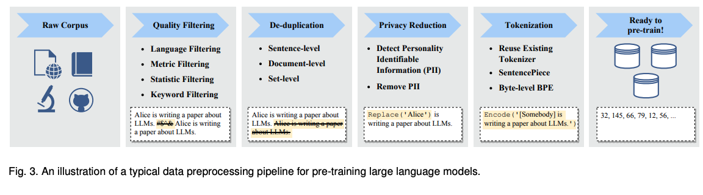

* 质量过滤。删除低质量数据现有方法主要有两种：基于分类和基于启发式。前一种方法基于高质量文本训练选择分类器，并利用它来识别和过滤掉低质量数据。但是分类方法可能错误去掉高质量数据，导致偏差和多样性减少。启发式方法通过精心设计规则来过滤低质量数据，包括以下方法：
	* 基于语言的过滤：对于单语言任务，只保留目标语言
	* 基于指标的过滤：文本生成的评估指标，如困惑度，用于删除不自然的句子
	* 基于统计的过滤：语料的统计学特征，如标点分布、符号-字符比、句子长度。
	* 基于关键词的过滤：特殊关键词，如HTML标记、超链接、模板和攻击性词语。
* 去重。研究表明语料中的重复数据集会减少语言模型的多样性，导致训练过程不稳定、影响模型性能。去重可以从不同粒度进行，包括句子级别、文档级别和数据集级别。首先，包含重复词和短语的低质量句子应该去除，因为它们会带来语言模型的重复问题。在文档层面，现有研究大多依靠文档之间表面特征的重叠率（例如，单词和n-grams重叠）来检测和去除包含相似内容的重复文档。此外，为了避免数据集污染问题，通过从训练集中删除可能的重复文本来防止训练集和评估集之间的重叠也很重要。已经有研究表明，三个级别的去重对提高LLM的训练是有用的，应该在实践中联合使用。
* 隐私修订。大多数预训练文本数据是从网络资源中获得的，包括涉及敏感或个人信息的用户生成的内容，这可能会增加隐私泄露的风险。 因此，有必要从预训练语料库中删除个人身份信息 (PII)。 一种直接有效的方法是采用基于规则的方法（例如关键字识别）来检测和删除PII，例如姓名、地址和电话号码。 此外，研究人员还发现，LLM在隐私攻击下的脆弱性可归因于预训练语料库中存在重复的PII数据。因此，去重也能在一定程度上降低隐私风险。
* 分词（Tokenization）。分词也是数据预处理的关键步骤。它旨在将原始文本分割成单个token的序列，这些token随后用作LLM的输入。 尽管利用现有的分词器（例如，OPT和 GPT-3利用 GPT-2的分词器）很方便，但使用专门为预训练语料库设计的分词器可能非常有益，特别是对于由不同领域、语言和格式组成的语料库。 因此，最近的几个LLM使用SentencePiece专门为预训练语料库训练定制的分词器。 字节级字节对编码（BPE）算法用于确保标记化后的信息无损。 同时，BPE中的规范化技术，例如NFKC，可能会降低标记化性能。

#### 4.1.3 预训练数据对LLM的影响
与小型 PLM 不同，由于对计算资源的巨大需求，多次迭代 LLM 的预训练通常是不可行的。 因此，在训练 LLM 之前构建一个准备充分的预训练语料库尤为重要。 在这一部分中，我们将讨论预训练语料库的质量和分布如何潜在地影响 LLM 的性能。

* 混合来源。 如前所述，来自不同领域或场景的预训练数据具有不同的语言特征或语义知识。 通过对来自不同来源的混合文本数据进行预训练，LLM可以获得广泛的知识，并可能表现出强大的泛化能力。 当混合不同的来源时，需要仔细设置预训练数据的分布，因为它也可能影响LLM在下游任务上的表现。 Gopher对数据分布进行了消融实验，以检验混合源数据对下游任务的影响。在LAMBADA数据集上的实验结果表明，增加书籍数据的比例可以提高模型从文本中捕获长期依赖关系的能力，而增加C4数据集的比例可以提高模型在C4验证数据集的性能。 同时，作为副作用，对某个领域的过多数据进行训练会影响 LLM 在其他领域的泛化能力。因此，建议研究人员谨慎确定预训练语料库中来自不同领域的数据的比例，以开发更符合其特定需求的 LLM。不同LLM的数据来源对比，可以参考图2。
* 预训练数据量。 为了预训练一个有效的LLM，重要的是收集足够的高质量数据来满足LLM的数据量需求。 现有研究发现，随着LLM中参数规模的增加，也需要更多的数据来训练模型：关于模型性能，数据大小也观察到与模型大小类似的缩放规律。最近的一项研究表明，由于预训练数据不足，许多现有的LLM都仅达到次优训练。通过进行广泛的实验，它进一步证明了在给定的计算预算下，以相同的比例增加模型大小和数据大小可以导致计算效率更高的模型（即Chinchilla模型）。最近，LLaMA表明，随着更多数据和更长时间的训练，更小的模型也可以取得良好的性能。总体而言，建议研究人员更加关注高质量数据的数量，以充分训练模型，尤其是在缩放模型参数时。
* 预训练数据的质量。现有工作表明，在低质量语料库上进行预训练，例如嘈杂、有毒和重复的数据，可能会损害模型的性能。为了开发性能良好的 LLM，至关重要的是要同时考虑所收集训练数据的数量和质量。最近的研究，如T5、GLaM和Gopher，调查了数据质量对下游任务性能的影响。通过比较在过滤和未过滤语料库上训练的模型的性能，他们得出了相同的结论，即在干净数据上预训练LLM可以提高性能。更具体地说，数据的重复可能会导致“双重下降”（指的是性能最初恶化然后改善的现象），甚至压倒训练过程。 此外，已经表明重复数据会降低LLM从上下文中复制的能力，这可能会进一步影响使用上下文学习的LLM的泛化能力。因此，必须在预训练语料库中仔细结合预处理方法（如第 4.1.2 节所示），以提高训练过程的稳定性并避免影响模型性能。

### 4.2 架构
介绍LLM架构设计，即主流架构、预训练目标、具体配置。
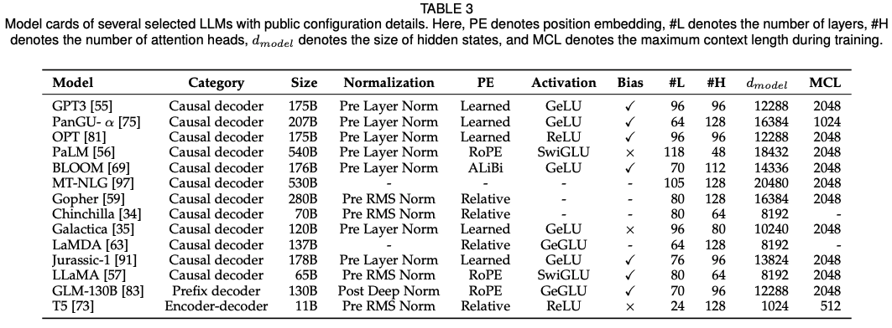

#### 4.2.1 主流架构
主要有三种：encoder-decoder、causal decoder、prefix decoder。
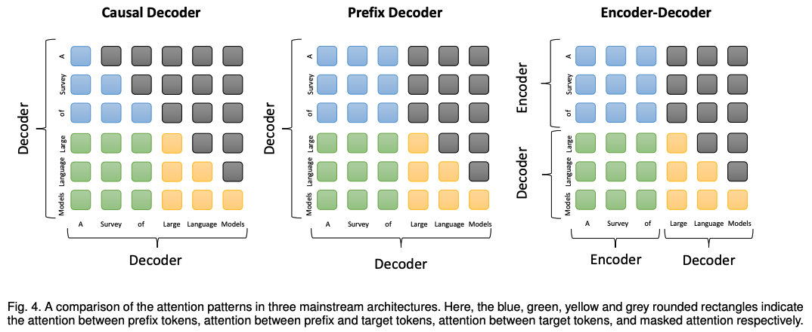

* encoder-decoder架构。 vanilla Transformer模型建立在编码器-解码器架构之上，它由两个堆叠的Transformer块组成，分别作为编码器和解码器。编码器采用堆叠的多头自注意层对输入序列进行编码以生成其潜在表示，而解码器对这些表示进行交叉注意并自回归生成目标序列。编码器-解码器 PLM（例如T5和 BART）已在各种 NLP 任务中显示出有效性。到目前为止，只有少量的 LLM 是基于编码器-解码器架构构建的，例如 Flan-T5。我们将在第 4.2.4 节中详细讨论架构选择。
* causal decoder架构。causal decoder架构结合了单向注意掩码，以保证每个输入标记只能关注过去的标记和它自己。输入和输出token通过解码器以相同的方式处理。作为该架构的代表性语言模型，GPT系列模型是基于causal decoder架构开发的。 特别是，GPT-3已经成功地证明了这种架构的有效性，也展示了LLM惊人的上下文学习（in-context learning）能力。有趣的是，GPT-1 [105] 和 GPT-2 [26] 并没有表现出像 GPT-3 那样优越的能力，而且似乎缩放在增加该模型架构的模型容量方面起着重要作用。到目前为止，causal decoder已被各种现有的LLM广泛采用作为LLM的体系结构，例如OPT、BLOOM和Gopher。 请注意，接下来讨论的causal decoder和prefix decoder都属于decoder-only架构。而在提到“decoder-only架构”时，除非特别说明，否则主要指的是现有文献中的causal decoder架构。
* prefix decoder架构。 前缀解码器架构（又名，non-causal decoder）修改了causal decoder的掩码机制，以实现对前缀token的双向关注和仅对生成的token的单向关注。这样，就像encoder-decoder架构一样，prefix decoder可以对前缀序列进行双向编码，并自回归地逐个预测输出标记，其中在编码和解码期间共享相同的参数。与其从头开始预训练，一个实用的建议是不断训练causal decoder，然后将它们转换为前缀解码器以加速收敛，例如，U-PaLM源自PaLM。 现有的基于prefix decoder的代表性LLM包括GLM-130B和U-PaLM。

对于这三种类型的架构，我们还可以考虑通过混合专家 (MoE) 缩放来扩展它们，其中每个输入的神经网络权重子集被稀疏激活，例如 Switch Transformer和GLaM。通过增加专家数量或总参数大小，可以观察到显著的性能改进。
#### 4.2.2 详细配置
讨论4个部分的配置，包括归一化、位置嵌入、激活函数以及注意力和偏差。
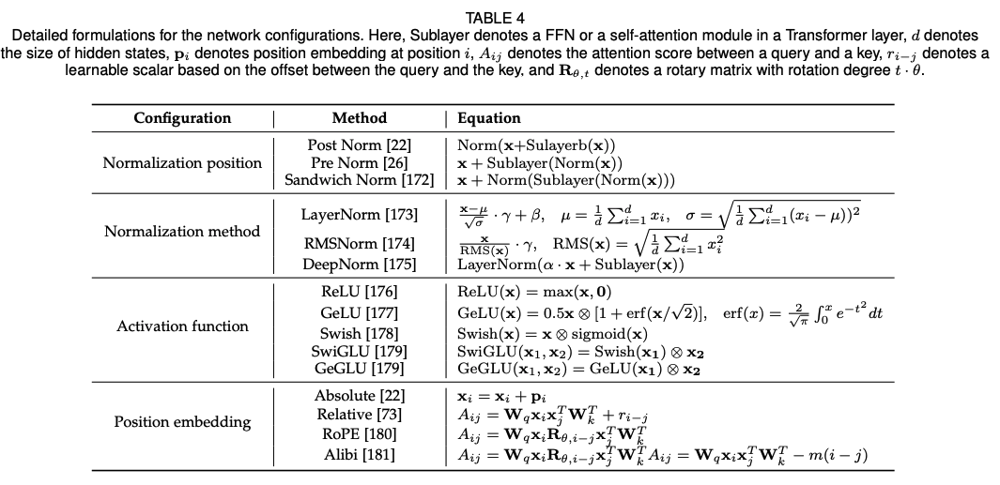

* 正则化。 训练不稳定性对于预训练 LLM 来说是一个具有挑战性的问题。为了缓解这个问题，层正则化（Layer Norm，LN）被广泛应用于Transformer架构中。LN 的位置对 LLM 的表现至关重要。虽然最初的Transformer使用 post-LN，但大多数LLM使用pre-LN来进行更稳定的训练，尽管性能有所下降。基于pre-LN，Sandwich-LN在残差连接之前添加额外的LN以避免数值爆炸。 然而，已经发现Sandwich-LN有时无法稳定LLM的训练，并可能导致训练崩溃。最近，已经提出了几种高级归一化技术作为LN的替代方案。在Gopher和Chinchilla中，RMS范数由于其在训练速度和性能方面的优势而被采用。与LN相比，DeepNorm表现出更好的能力来确保训练的稳定性，已经被GLM-130B结合后归一化使用。 此外，在embedding层后增加一个额外的LN也可以稳定LLM的训练。然而，它往往会导致性能显着下降，这在最近的几个LLM中已被删除。
* 激活函数。现有的LLM中，GeLU被广泛使用。在最新的LLM中，使用了GLU的变种，特别是SwiGLUst和GeGLU，在实际使用中可以获得更好的效果。然而，与GeLU相比，它们在前馈网络中需要额外的参数（大概50%）。
* 位置编码。由于 Transformer 中的自注意力模块是置换等变的，因此使用位置嵌入来为建模序列注入绝对或相对位置信息。vanilla Transformer中有两种绝对位置嵌入变体，即正弦波和可学习位置嵌入，后者通常用于 LLM。与绝对位置嵌入不同，相对位置编码根据键（key）和查询（query）之间的偏移量生成嵌入，因此它可以在比训练期间看到的序列更长的序列上表现良好，即外推。 ALiBi使用基于键和查询之间距离的惩罚来偏置注意力分数。实证结果表明，与其他位置嵌入相比，它具有更好的零样本泛化和更强的外推能力。此外，通过根据绝对位置设置特定的旋转矩阵，可以使用相对位置信息计算RoPE中键和查询之间的分数，这对于建模长序列很有用。因此，RoPE已在几个最新的LLM中得到广泛采用。
* Attention和bias。除了原始Transformer中的完全自注意力之外，GPT-3还采用了计算复杂度较低的稀疏注意力（即 Factorized Attention）。为了有效和高效地建模更长的序列，通过引入特殊的注意力模式或考虑GPU内存访问（即FlashAttention）进行了更多尝试。此外，在最初的Transformer之后，大多数LLM在每个dense层和Layer Norm中都保留了bias。然而，在PaLM和 Galactica中，bias被取消了。它表明没有bias可以提高LLM的训练稳定性。

为了将所有这些讨论放在一起，我们总结了现有文献中关于详细配置的建议。为了更强的泛化和训练稳定性，建议层归一化选择pre RMS Norm，激活函数选择SwiGLU或GeGLU。同时，LN可能不会在嵌入层之后立即使用，这可能会导致性能下降。此外，对于位置编码，RoPE或ALiBi是更好的选择，因为它们在长序列上表现更好。

#### 4.2.3 预训练任务
LLM有两个常用预训练任务，分别是语言模型（language modeling）和去噪自编码（denoising autoencoding）。

* 语言模型。给定一个token序列$x={x_1,...,x_n}$，LM任务旨在根据前面的token $x_{<i}$自回归地预测目标token $x_i$的任务。通常的训练目标是最大化以下似然函数：
$$ LLM(x) = \sum_{i=1}^{n} log P(x_i|x_{<i}) $$
由于大多数语言任务可以视为基于输入的预测问题，这些仅解码器的LM在隐式学习以统一的LM方式完成这些任务方面可能具有优势。一些研究还表明，decoder-only的LM可以通过自回归地预测下一个标记而无需微调来自然地转移到某些任务中。LM的一个重要变体是前缀语言建模任务，用于使用前缀解码器架构预训练模型。在计算前缀语言建模损失时，不会使用随机选择前缀中的标记。在相同的预训练期间看到的标记数量下，前缀语言建模的性能略低于语言建模，因为序列中涉及的标记数量较少。
* 去噪自编码（Denoising Autoencoding，DAE）任务。除了传统的LM，去噪自编码任务（DAE）也广泛用于预训练语言模型。DAE任务的输入$x_{-\widetilde{x}}$是带有随机替换片段的损坏文本。然后，语言模型被训练以恢复替换的标记$\widetilde{x}$。形式上，DAE的训练目标可以表示如下：
$$L_{DAE}(x) = log P(\widetilde{x}|x_{-\widetilde{x}})$$
然而，与LM任务相比，DAE任务在实现上似乎更加复杂。因此，它并没有广泛用于预训练大型语言模型。采用DAE作为预训练目标的现有LLM包括T5和GLM-130B等模型。这些模型主要通过自回归方式来恢复替换的片段。

#### 4.2.4 总结和讨论
架构和预训练任务的选择可能会为LLM（语言模型）引入不同的归纳偏差，从而导致不同的模型容量。在这部分中，我们总结了现有文献中关于这个问题的一些重要发现或讨论。

* 通过使用LM目标进行预训练，似乎因果解码器（causal decoder）架构可以实现更优越的零样本和少样本泛化能力。现有研究表明，在没有进行多任务微调的情况下，因果解码器的零样本性能优于其他架构。GPT-3的成功证明了大型因果解码器模型可以成为一个出色的少样本学习器。此外，第5节讨论的指令微调（instruction tuning）和对齐微调（alignment tuning）已被证明可以进一步增强大型因果解码器模型的能力。

* 在因果解码器中普遍观察到了缩放定律（scaling law）。通过增加模型大小、数据集大小和总计算量，可以显著提高因果解码器的性能。因此，通过缩放成为增加因果解码器模型容量的重要策略。然而，对于编码器-解码器模型的更详细研究仍然不足，需要进一步研究大规模编码器-解码器模型的性能。

需要进行更多关于架构和预训练目标的讨论的研究工作，以分析架构和预训练任务选择对LLM容量的影响，特别是对于编码器-解码器架构。除了主要架构外，LLM的详细配置也值得关注，这在第4.2.2节中已经讨论过。

### 4.3 模型训练
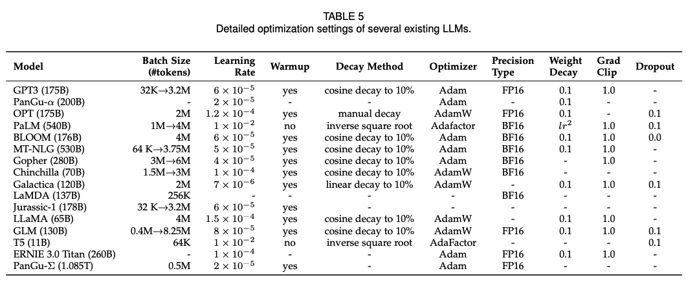
#### 4.3.1 优化设置
对于 LLM 的参数优化，我们提供了批量训练、学习率、优化器和训练稳定性的常用设置。

* 批量训练。对于语言模型的预训练，现有的工作通常将批量大小设置为一个较大的数字（例如8,196个样本或16M个token），以提高训练的稳定性和吞吐量。对于像GPT-3和PaLM这样的LLM，它们引入了一种新的策略，在训练过程中动态增加批量大小，最终达到百万级别。具体而言，GPT-3的批量大小从32K逐渐增加到3.2M个标记。实证结果表明，批量大小的动态调度可以有效稳定LLM的训练过程。
* 学习率。现有的LLM通常在预训练期间采用类似的学习率调度，包括warm-up和衰减策略（decay strategy）。具体而言，在训练步骤的初始0.1%到0.5%之间，采用linear warm-up调度，逐渐增加学习率，将其增加到最大值，大约在$5 × 10^{-5}$到$1 × 10^{-4}$的范围内（例如，GPT-3的学习率为$6 × 10^{-5}$）。然后，在后续步骤中采用余弦衰减策略，逐渐将学习率降低到其最大值的约10%，直到训练损失收敛。
* 优化器。Adam优化器和AdamW优化器被广泛应用于训练LLM（例如GPT-3），它们基于对一阶梯度进行自适应估计的低阶矩进行优化。通常，它们的超参数设置如下：$β1 = 0.9，β2 = 0.95，ε = 10^{-8}$。与此同时，Adafactor优化器也被用于训练LLM（例如PaLM和T5），它是Adam优化器的一种变体，专门设计用于在训练过程中节省GPU内存。Adafactor优化器的超参数设置为：$β1 = 0.9，β2 = 1.0 - k^{-0.8}$，其中k表示训练步骤的数量。
* 训练稳定化。在LLM的预训练过程中，常常会遇到训练不稳定的问题，可能导致模型崩溃。为了解决这个问题，广泛采用了权重衰减和梯度裁剪的方法，现有研究通常将梯度裁剪的阈值设定为1.0，权重衰减率设定为0.1。然而，随着LLM的规模扩大，训练损失的突然增加也更容易发生，导致训练不稳定。为了缓解这个问题，PaLM和OPT采用了一种简单的策略，在突然增加发生之前，从早期的检查点重新启动训练过程，并跳过可能引起问题的数据。此外，GLM发现嵌入层的异常梯度通常会导致训练损失的突然增加，并提出缩小嵌入层梯度的方法来缓解这个问题。

#### 4.3.2 可扩展训练技术
随着模型和数据规模的增加，在有限的计算资源下高效训练LLM变得具有挑战性。尤其是需要解决两个主要的技术问题，即增加训练吞吐量和将更大的模型加载到GPU内存中。在这部分中，我们回顾了现有研究中几种广泛使用的方法来解决上述两个挑战，包括3D并行，ZeRO和混合精度训练，并提出了关于如何利用它们进行训练的一般建议。

* 3D并行。3D并行实际上是三种常用的并行训练技术的结合，即数据并行、管道并行（流水线并行pipeline parallelism）和张量并行。接下来，我们将介绍这三种并行训练技术。
	* 数据并行。数据并行是提高训练吞吐量的最基本方法之一。它在多个GPU上复制模型参数和优化器状态，然后将整个训练数据集分配到这些GPU上。这样，每个GPU只需要处理分配给它的数据，并进行前向和反向传播以计算梯度。不同GPU上计算得到的梯度将进一步聚合，得到整个批次的梯度，用于更新所有GPU上的模型。由于梯度计算在不同GPU上是独立进行的，数据并行机制具有高度可扩展性，可以通过增加GPU的数量来提高训练吞吐量。此外，这种技术在实现上很简单，大多数现有的流行深度学习库已经实现了数据并行，例如TensorFlow和PyTorch。
	* 管道并行。管道并行旨在将LLM的不同层分布到多个GPU上。特别是对于Transformer模型，管道并行将连续的层加载到同一个GPU上，以减少在不同GPU之间传输计算得到的隐藏状态或梯度的成本。然而，一个朴素的管道并行实现可能导致较低的GPU利用率，因为每个GPU必须等待前一个GPU完成计算，从而产生不必要的气泡开销（bubbles overhead）。为了减少管道并行中的这些气泡，GPipe和PipeDream提出了填充多批次数据和异步梯度更新的技术，以提高管道效率。
	* 张量并行。张量并行也是一种常用的技术，旨在将LLM分解为多个GPU加载。与管道并行不同，张量并行专注于分解LLM的张量（参数矩阵）。对于LLM中的矩阵乘法操作$Y = XA$，参数矩阵A可以按列分为两个子矩阵A1和A2，表示为$Y = [XA1, XA2]$。通过将矩阵A1和A2放置在不同的GPU上，矩阵乘法操作可以在两个GPU上并行调用，并通过跨GPU通信将两个GPU的输出组合以获得最终结果。目前，几个开源库已经支持张量并行，例如Megatron-LM，并且可以扩展到更高维的张量。此外，Colossal-AI还实现了针对更高维度张量的张量并行，并提出了序列并行，特别适用于序列数据，可以进一步分解Transformer模型的注意力操作。
* ZeRO。ZeRO技术是DeepSpeed库提出的一种技术，专注于解决数据并行中的内存冗余问题。如前所述，数据并行要求每个GPU存储LLM的相同副本，包括模型参数、模型梯度和优化器参数。然而，并不是所有上述数据都需要在每个GPU上保留，这会导致内存冗余问题。为了解决这个问题，ZeRO技术旨在在每个GPU上只保留部分数据，其余数据可以在需要时从其他GPU中检索。具体而言，ZeRO提供了三种解决方案，取决于如何存储这三部分数据，即优化器状态分区、梯度分区和参数分区。实证结果表明，前两个解决方案不会增加通信开销，而第三个解决方案会增加约50%的通信开销，但可以节省与GPU数量成比例的内存。PyTorch已经实现了类似于ZeRO的技术，称为FSDP。
* 混合精度训练。在之前的PLMs（例如BERT）中，主要使用32位浮点数，也称为FP32，进行预训练。近年来，为了预训练极大规模的语言模型，一些研究开始使用16位浮点数（FP16），从而减少内存使用和通信开销。此外，由于流行的NVIDIA GPU（例如A100）的FP16计算单元数量是FP32的两倍，FP16的计算效率可以进一步提高。然而，现有研究发现FP16可能导致计算精度的损失，从而影响最终模型的性能。为了缓解这个问题，人们使用了一种称为Brain Floating Point（BF16）的替代方法进行训练，它分配给指数位更多的位数，而有效位数较少，比FP16更精确。在预训练中，BF16通常在表示精度方面表现更好。
* 总体训练建议。在实践中，上述训练技术，特别是3D并行，通常会联合使用以提高训练吞吐量和大模型加载能力。例如，研究人员已经将8路数据并行、4路张量并行和12路管道并行结合起来，使得BLOOM模型能够在384个A100 GPU上进行训练。目前，开源库如DeepSpeed、Colossal-AI和Alpa可以很好地支持这三种并行训练方法。为了减少内存冗余，可以使用ZeRO、FSDP和激活重计算等技术进行LLM的训练，这些技术已经集成到DeepSpeed、PyTorch和Megatron-LM中。此外，混合精度训练技术（如BF16）也可以利用，以提高训练效率并减少GPU内存的使用，但需要硬件（如A100 GPU）的支持。由于训练大型模型是一个耗时的过程，在早期阶段进行模型性能预测和异常问题检测将非常有用。为此，GPT-4最近引入了一种称为可预测扩展的新机制，建立在深度学习堆栈之上，可以使用一个更小的模型对大型模型进行性能预测，这对于开发LLM非常有用。在实践中，可以进一步利用主流深度学习框架的支持训练技术。例如，PyTorch支持名为FSDP（完全分片数据并行）的数据并行训练算法，如果需要，它允许将部分训练计算转移到CPU上。

除了上述的训练策略之外，提高LLM在推理阶段的速度也非常重要。通常，量化技术被广泛应用于减少LLM在推理阶段的时间和空间成本。伴随着模型性能上有所损失，量化的语言模型具有更小的模型大小，并且可以实现更快的推理速度。在模型量化方面，一种常见的选择是INT8量化。此外，一些研究工作尝试开发更激进的INT4量化方法。最近，几个公开可用的语言模型的量化模型副本已经在Hugging Face上发布，包括BLOOM、GPT-J和ChatGLM。

## 5. 自适应调整

在预训练之后，LLM可以获得解决各种任务的通用能力。然而，越来越多的研究表明，LLM的能力可以根据特定目标进一步进行适应。在本节中，我们介绍了两种主要的适应预训练LLM的方法，即指令调整和对齐调整。前一种方法主要旨在增强（或释放）LLM的能力，而后一种方法旨在使LLM的行为与人类的价值观或偏好相一致。此外，我们还将讨论快速模型适应的高效调整方法。接下来，我们将详细介绍这三个部分。
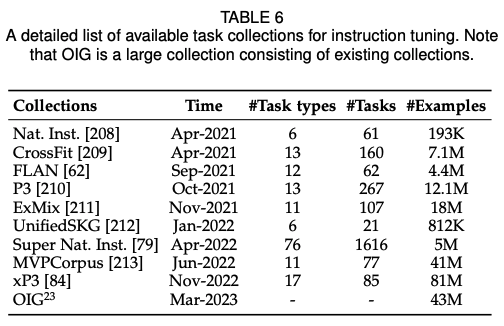

### 5.1 指令调整
实质上，指令调整是对以自然语言形式呈现的一系列格式化实例进行预训练LLM的微调方法，它与监督微调和多任务提示训练密切相关。为了进行指令调整，我们首先需要收集或构建格式化的指令实例。然后，我们使用这些格式化实例以监督学习的方式对LLM进行微调（例如，使用序列到序列损失进行训练）。在进行指令调整后，LLM可以展示出在没见过的任务上具有优越的泛化能力，甚至在多语言环境下也能如此。最近的一项调查研究系统地概述了关于指令调整的研究。与此相比，我们主要关注指令调整对LLM的影响，并提供详细的实例收集和调整指南或策略。此外，我们还讨论了使用指令调整来满足用户的实际需求，在现有的LLM中已经广泛应用，例如InstructGPT和GPT-4。

#### 5.1.1 格式化实例构建
通常，一个格式化的指令实例包括任务描述（称为指令）、输入-输出对以及一小部分示范（可选）。作为重要的公共资源，现有的研究已经发布了大量以自然语言格式化的标记数据（请参见表6中的可用资源列表）。接下来，我们介绍两种构建格式化实例的主要方法（参见图5中的示例），然后讨论实例构建的几个关键因素。
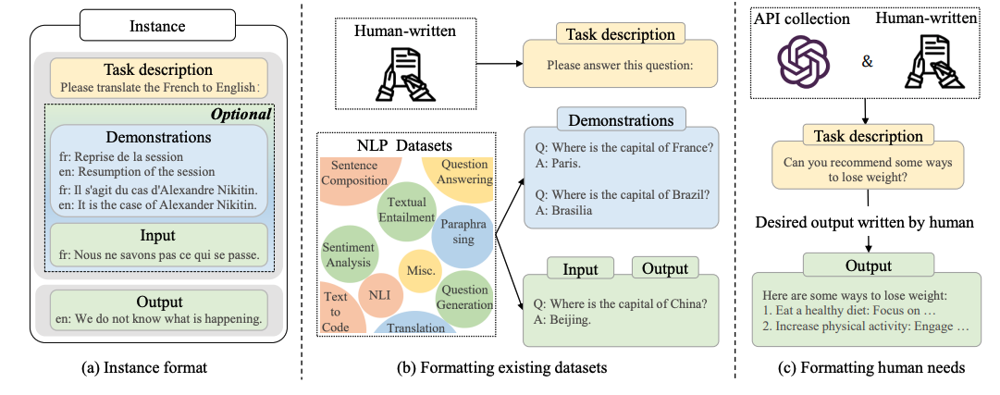

* 格式化已有数据集。在提出指令调整之前，一些早期的研究收集了来自各种任务（如文本摘要、文本分类和翻译）的实例，创建了监督式多任务训练数据集。作为指令调整实例的主要来源，使用自然语言任务描述格式化这些多任务训练数据集非常方便。具体而言，最近的工作通过添加人工编写的任务描述来扩充带标签的数据集，这些描述指导LLM理解任务并解释任务目标。例如，在图5(b)中，针对问答任务中的每个示例都添加了一个任务描述“请回答这个问题”。在指令调整之后，LLM可以通过遵循任务描述来很好地推广到其他未见过的任务。特别是已经显示指令是LLM任务推广能力的关键因素：通过在去除任务描述的带标签数据集上进行微调，会导致模型性能的显著下降。为了更好地为指令调整生成标记实例，提出了一种众包平台PromptSource，用于有效地创建、共享和验证不同数据集的任务描述。为了丰富训练实例，还有几项研究尝试通过特别设计的任务描述来反转现有实例的输入-输出对，用于指令调整。例如，给定一个问答对，我们可以通过预测以问题为条件的答案（例如，“请根据答案生成一个问题”）来创建一个新的实例。此外，一些工作还利用启发式任务模板将大量无标签的文本转换为带标签的实例。
* 格式化人类需求。尽管已经对许多训练实例进行了指令格式化，但它们主要来自公共的NLP数据集，要么缺乏指令的多样性，要么与真实的人类需求不匹配。为了解决这个问题，InstructGPT提议将用户提交给OpenAI API的查询作为任务描述。用户查询以自然语言表达，特别适合引出LLM遵循指令的能力。此外，为了丰富任务的多样性，还要求人工标注者为现实生活中的任务编写指令，包括开放式生成、开放式问题回答、头脑风暴和聊天。然后，他们让另一组标注者直接回答这些指令作为输出。最后，将一个指令（即收集到的用户查询）和期望的输出（即人工编写的答案）配对成为一个训练实例。值得注意的是，InstructGPT还使用这些以自然语言格式化的现实任务进行了对齐调整（在第5.2节讨论）。此外，GPT-4 [46]还设计了潜在的高风险指令，并通过监督式微调引导模型拒绝这些指令，以确保安全性。此外，为了减轻人工标注的负担，还提出了几种半自动化方法，通过将现有实例输入LLM以生成多样化的任务描述和实例。
* 实例构建的关键因素。指令实例的质量对模型的性能有重要影响。在这里，我们讨论一些实例构建的关键因素。
	* 扩展指令。已经广泛证明，增加任务数量可以大大增强LLM的泛化能力。随着任务数量的增加，模型性能一开始呈现连续增长的趋势，但当达到一定水平后，增益变得微不足道。一个合理的推测是，一定数量的代表性任务可以提供相对充分的知识，添加更多的任务可能不会带来额外的收益。此外，在任务描述的多样性方面，提高任务描述的长度、结构和创造力也是有益的。至于每个任务的实例数量，已经发现只需要少量的实例通常就能达到模型的泛化性能饱和点。然而，对于某些任务，将实例数量增加到很大程度（例如几百个）可能会导致过拟合问题，损害模型性能。
	* 格式设计。作为一个重要因素，自然语言格式的设计也极大地影响着LLM的泛化性能。通常情况下，我们可以在现有数据集的输入-输出对中添加任务描述和可选的示范，其中任务描述是LLM理解任务的关键部分。此外，通过使用适当数量的示范作为演示，可以大幅度提高性能，并减轻模型对指令工程的敏感性。然而，将其他组成部分（如要避免的事项、原因和建议）纳入指令中可能对LLM的性能产生微不足道甚至逆效果。最近，为了引发LLM的逐步推理能力，一些研究提出在某些推理数据集（如算术推理）中包含思路链（CoT）示例。已经证明，使用同时包含CoT示例和非CoT示例的指令对LLM进行微调可以在各种推理任务上取得良好的性能，包括那些需要多次推理能力的任务（如常识问题回答和算术推理）以及那些不需要此类推理方式的任务（如情感分析和提取式问题回答）

综上所述，似乎指令的多样性比实例的数量更为重要，因为表现良好的InstructGPT和Alpaca所使用的指令（或实例）比Flan系列LLM更少但更具多样性。此外，邀请标注者撰写符合人类需求的任务比使用特定数据集的任务更有用。然而，目前缺乏关于标注符合人类需求实例的准则，使得任务的构成在某种程度上是启发式的。为了减少人力投入，我们可以重复使用现有的格式化数据集（表6），或者使用现有的LLM自动构建指令。

#### 5.1.2 指令调整策略
与预训练不同，指令调整通常更加高效，因为只使用了适量的实例进行训练。由于指令调整可以被视为一种有监督的训练过程，它在优化上与预训练有几个方面的不同，例如训练目标（即序列到序列损失）和优化配置（如较小的批量大小和学习率），在实践中需要特别注意。除了这些优化配置外，还有两个重要方面需要考虑指令调整：

* 平衡数据分布。由于指令调整涉及不同任务的混合，因此在微调期间平衡不同任务的比例非常重要。一个广泛使用的方法是示例比例混合策略，即将所有数据集组合在一起，从混合数据集中平等采样每个实例。此外，根据最近的研究发现，增加高质量数据集（如FLAN和P3）的采样比例通常会导致性能改善。然而，在指令调整过程中，通常会设置一个最大限制，以控制数据集可以包含的最大示例数目，这样做是为了防止较大的数据集对整体分布造成过大影响。在实践中，最大限制通常根据不同数据集设置为几千或几万个示例。
* 结合指令调整和预训练。为了使调整过程更加有效和稳定，OPT-IML在指令调整期间融入了预训练数据，这可以看作是模型调整的正则化过程。此外，一些研究尝试使用多任务学习的方法，通过将预训练数据（即纯文本）和指令调整数据（即格式化数据集）混合训练来从头开始训练模型，而不是使用单独的两阶段过程（预训练然后指令调整）。具体而言，GLM-130B和Galactica将指令格式化的数据集作为预训练语料库的一小部分，对LLM进行预训练，这可能同时实现了预训练和指令调整的优势。

#### 5.1.3 指令调整的影响
在这一部分中，我们从两个主要方面讨论了指令调优对 LLM 的影响。
* 性能提升。尽管在少量实例上进行调整，但指令调整已成为改进或释放LLM能力的重要方式。最近的研究对多个规模（从77M到540B不等）的语言模型进行了实验，表明不同规模的模型都可以从指令调整中受益，随着参数规模的增加，性能得到改善。此外，经过指令调整的较小模型甚至可以比未进行微调的较大模型表现更好。除了模型规模，指令调整在各种模型架构、预训练目标和模型适应方法中都表现出一致的改进。在实践中，指令调整提供了一种通用的方法来增强现有语言模型的能力（包括小型PLM）。此外，与预训练相比，它的成本要低得多，因为LLM所需的指令数据量明显小于预训练数据。
* 任务泛化。指令调整鼓励模型理解用于任务完成的自然语言指令。它赋予LLM能够遵循人类指令的能力（通常被视为一种涌现能力），即使在未见过的任务上，也能执行特定任务而无需演示。大量研究已经证实了指令调整在实现对已知和未知任务上的卓越性能方面的有效性。此外，指令调整已被证明对缓解LLM的一些弱点（例如重复生成或仅补充输入而未完成特定任务）很有帮助，从而使LLM在解决现实世界任务方面具有卓越能力。此外，经过指令调整训练的LLM可以在不同语言之间泛化到相关任务。例如，BLOOMZ-P3是基于BLOOM通过使用仅英语的任务集合P3进行微调的。有趣的是，与BLOOM相比，BLOOMZ-P3在多语句完成任务上可以实现超过50%的改进，这表明指令调整可以帮助LLM从仅英语的数据集中获得一般任务技能，并将这些技能转移到其他语言中。此外，研究发现在多语言任务上使用仅英语指令也能产生令人满意的结果，这有助于减少特定语言的指令工程工作量。

### 5.2 对齐调整
本部分首先介绍了对齐的背景、定义和标准，然后重点讨论了用于对齐LLM的人类反馈数据的收集，并最后讨论了基于人类反馈的强化学习在对齐调整中的关键技术。
#### 5.2.1 对齐的背景和标准
* 背景：LLM在各种自然语言处理任务中展示出了显著的能力。然而，这些模型有时可能会出现意想不到的行为，例如捏造虚假信息、追求不准确的目标以及产生有害、误导性和偏见的表达。对于LLM来说，语言建模的目标是通过单词预测来预训练模型参数，但它缺乏对人类价值观或偏好的考虑。为了避免这些意外行为，人类对齐被提出来使LLM按照人类的期望行事。然而，与原始的预训练和自适应训练（例如指令调整）不同，这种对齐需要考虑非常不同的标准（例如有用性、诚实性和无害性）。研究表明，对齐可能在一定程度上损害LLM的一般能力，这在相关文献中被称为对齐成本（alignment tax）。
* 对齐标准：最近，人们越来越关注开发多样化的标准来规范LLM的行为。在这里，我们以三个典型的对齐标准（即有用、诚实和无害）作为例子进行讨论，这些标准已经被广泛采用在现有的文献中。此外，还有其他从不同角度对LLM制定的对齐标准，包括行为、意图、激励和内在等方面 ，这些标准本质上与上述三个标准是相似的（或者至少在对齐技术上是相似的）。根据具体需求，修改这三个标准也是可行的，例如用正确性替代诚实性，或者专注于某些特定的标准。接下来，我们对这三个代表性的对齐标准进行简要解释：
	* 有用性（Helpfulness）：为了具有有用性，LLM应该清晰地尝试以尽可能简洁高效的方式帮助用户解决任务或回答问题。在更高层面上，当需要进一步澄清时，LLM应该展示出通过相关问题引出额外相关信息的能力，并展现出适当的敏感性、洞察力和谨慎性。对于LLM来说，实现有用行为的对齐是具有挑战性的，因为准确定义和衡量用户意图是困难的。
	* 诚实性（Honesty）：在基本层面上，对齐为诚实的LLM应向用户呈现准确的内容，而不是虚构信息。此外，LLM还应适当表达其输出中的不确定性程度，以避免任何形式的欺骗或信息歪曲。这要求模型了解其能力和知识水平（例如，“知道自己不知道”）。据一些论文讨论，诚实性是与有用性和无害性相比更客观的标准，因此诚实性对齐可能在很大程度上减少对人力的依赖。
	* 无害性（Harmlessness）：为了无害，模型产生的语言不应具有冒犯性或歧视性。在其能力范围内，模型应能够检测到旨在索取恶意目的的隐蔽行动。理想情况下，当模型被引导执行危险行为（例如犯罪）时，LLM应礼貌地拒绝。然而，被认为有害的行为及其程度在个体或社会之间存在差异，这高度取决于使用LLM的人，提出的问题类型以及LLM使用的上下文（例如时间）。

正如我们所见，这些标准非常主观，并且是基于人类认知发展起来的。因此，将它们直接制定为LLM的优化目标是困难的。在现有的工作中，有许多方法可以在对齐LLM时满足这些标准。一种有希望的技术是红队测试，它使用手动或自动手段以对抗性方式对LLM进行探测，生成有害的输出，然后更新LLM以防止此类输出。

#### 5.2.2 收集人类反馈
在预训练阶段，LLM使用语言建模目标在大规模语料库上进行训练。然而，它无法考虑到人类对LLM输出的主观和定性评估（在本调查中称为人类反馈）。高质量的人类反馈对于将LLM与人类的偏好和价值观相一致非常重要。在本部分中，我们讨论如何选择一个人类标注团队来进行反馈数据收集。

* 人类标注者选择。在现有的研究中，生成人类反馈数据的主要方法是人工标注。这凸显了选择合适的人类标注者的重要性。为了提供高质量的反馈，人类标注者应具备合格的教育水平和出色的英语能力。例如，Sparrow要求人类标注者是英国本土的以英语为母语的人，且至少获得本科学历。此外，在一篇论文中，对于高优先级任务的人类标注者约一半来自美国亚马逊机械土耳其工作人员，具备硕士学历。即便如此，一些研究发现研究人员的意图与人类标注者存在不匹配的情况，这可能导致低质量的人类反馈并使LLM产生意外的输出。为了解决这个问题，InstructGPT进一步进行筛选，通过评估人类标注者与研究人员之间的一致性来筛选标注者。具体而言，研究人员首先对少量数据进行标注，然后衡量他们与人类标注者之间的一致性。选择一致性最高的标注者进行后续的注释工作。在其他一些研究中，使用“超级标注者”来确保人类反馈的高质量。研究人员评估人类标注者的表现，并选择一组表现良好的人类标注者（例如，高一致性）作为超级标注者。超级标注者将优先与研究人员合作进行后续的研究。当人类标注者对LLM的输出进行标注时，明确详细的指导说明并为人类标注者提供即时指导是有帮助的，这可以进一步规范标注者的注释工作。
* 人类反馈数据收集。在现有的研究中，主要有三种方法来收集人类标注者的反馈和偏好数据。
	* 基于排名的方法。在早期的研究中，人类标注者通常以粗粒度的方式评估模型生成的输出（即只选择最好的），而没有考虑更细粒度的对齐标准。然而，不同的标注者可能对最佳候选输出的选择持有不同的意见，而这种方法忽略了未被选择的样本，可能导致不准确或不完整的人类反馈。为了解决这个问题，随后的研究引入了Elo评分系统，通过比较候选输出来确定偏好排名。输出的排名作为训练信号，指导模型偏好某些输出而不是其他输出，从而产生更可靠和更安全的输出。
	* 基于问题的方法。此外，人类标注者可以通过回答研究者设计的特定问题来提供更详细的反馈，这些问题涵盖了对LLM的对齐标准以及其他约束条件。特别是在WebGPT中，为了帮助模型筛选和利用从检索到的文档中提取的相关信息，要求人类标注者回答关于检索到的文档是否对回答给定输入有用的多选问题。
	* 基于规则的方法。此外，许多研究开发了基于规则的方法来提供更详细的人类反馈。以Sparrow为典型案例，它不仅选择标注者认为最好的回答，还使用一系列规则来测试模型生成的回答是否符合有用、正确和无害的对齐标准。通过这种方式，可以获得两种类型的人类反馈数据：(1) 通过比较成对的模型生成输出的质量来获得回答偏好反馈，(2) 通过收集标注者的评估（表示生成的输出违反规则的程度）来获得规则违反反馈。此外，GPT-4利用一组zero-shot分类器（基于GPT-4本身）作为基于规则的奖励模型，可以自动确定模型生成的输出是否违反了一组人工编写的规则。

接下来，我们将重点讨论一种著名的技术，即从人类反馈中进行强化学习（RLHF）。这种技术在最近强大的LLM（如ChatGPT）中被广泛应用。正如下面所讨论的，通过从用户查询的回复中学习人类反馈，可以实现在第5.2.1节中介绍的对齐标准。

#### 5.2.3 从人类反馈中强化学习
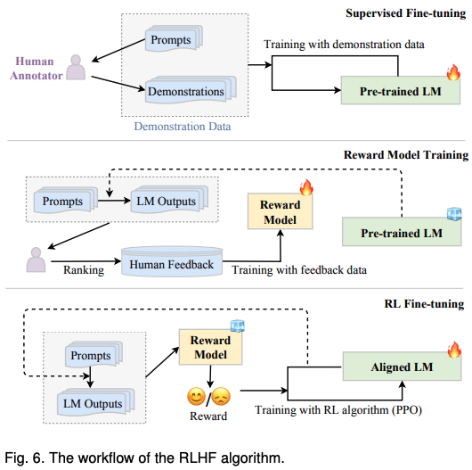

为了将LLM与人类价值观对齐，提出了从人类反馈中进行强化学习（RLHF）来利用收集到的人类反馈数据对LLM进行微调，从而改善对齐标准（如有益性、诚实性和无害性）。RLHF利用强化学习（RL）算法（如Proximal Policy Optimization (PPO)）来通过学习奖励模型将LLM调整到人类反馈中。这种方法将人类纳入训练循环中，以开发与人类价值观对齐的LLM，如InstructGPT所示。
* RLHF系统。RLHF系统主要由三个关键组件组成：待对齐的预训练LM、从人类反馈中学习的奖励模型以及训练LM的RL算法。具体而言，预训练LM通常是一个生成模型，其初始化使用现有的预训练LM参数。例如，OpenAI在其首个流行的RLHF模型InstructGPT中使用了175B GPT-3，而DeepMind在其GopherCite模型中使用了2800亿参数的模型Gopher。此外，奖励模型（RM）提供（学习得到的）指导信号，反映了人类对LM生成的文本的偏好，通常以标量值的形式表示。奖励模型可以采用两种形式：通过对人类偏好数据进行微调的LM或使用人类偏好数据从头训练的LM。现有工作通常使用与对齐LM参数规模不同的奖励模型。例如，OpenAI使用6B GPT-3，DeepMind使用7B Gopher作为奖励模型。最后，为了利用奖励模型的信号优化预训练LM，设计了专门的RL算法进行大规模模型调整。具体而言，Proximal Policy Optimization（PPO）是现有工作中用于对齐的广泛使用的RL算法。
* RLHF的关键步骤。图6展示了RLHF的整体三步过程，如下所介绍。
	* 监督微调。为了使LM最初能够表现出期望的行为，通常需要收集一个监督数据集，其中包含用于微调LM的输入提示（指令）和期望输出。这些提示和输出可以由人类标注者为特定任务编写，同时确保任务的多样性。例如，InstructGPT要求人类标注者为一些生成任务编写提示（例如，“列出五种恢复对职业的热情的方法”）和期望的输出，这些任务包括开放式问答、头脑风暴、聊天和改写。需要注意的是，第一步在特定的设置或场景中是可选的。
	* 奖励模型训练。第二步是使用人类反馈数据训练奖励模型（RM）。具体而言，我们使用LM根据抽样的prompt（来自监督数据集或人类生成的提示）生成一定数量的输出文本作为输入。然后，我们邀请人类标注者对这些配对进行偏好注释。注释过程可以采用多种形式进行，常见的方法是通过对生成的候选文本进行排序注释，这可以减少标注者之间的不一致性。然后，RM被训练以预测人类偏好的输出。在InstructGPT中，标注者将模型生成的输出按从最佳到最差的顺序进行排序，然后RM（即6B GPT-3）被训练以预测排名。
	* RL微调。在这一步骤中，将LM的对齐（即微调）形式化为一个RL问题。在这个设置中，预训练的LM作为策略，接收一个prompt作为输入并返回一个输出文本，其动作空间是词汇表，状态是当前生成的token序列，奖励由RM提供。为了避免与初始（调整前）LM明显偏离，常常在奖励函数中加入惩罚项。例如，InstructGPT使用PPO算法通过对RM进行优化来优化LM。对于每个输入提示，InstructGPT计算当前LM生成结果与初始LM之间的KL散度作为惩罚项。值得注意的是，第二步和最后一步可以进行多次迭代，以更好地对齐LLM。

### 5.3 高效调整（Efficient Tuning）
在上面，我们已经讨论了指令调整和对齐调整的方法，以根据特定目标调整LLM。由于LLM包含大量的模型参数，进行完整的参数调整将会非常昂贵。在本节中，我们将讨论如何对LLM进行高效的调整。我们首先回顾了几种代表性的用于Transformer语言模型的参数高效精调方法，然后总结了现有的参数高效精调LLM的研究工作。
#### 5.3.1 参数高效微调方法
在现有文献中，参数高效精调是一个重要的课题，旨在减少可训练参数的数量，同时尽可能保持良好的性能。接下来，我们简要回顾了四种用于Transformer语言模型的参数高效精调方法，包括Adapter Tuning、Prefix Tuning、Prompt Tuning和LoRA。
##### Adapter Tuning
Adapter tuning将小型神经网络模块（称为适配器）引入Transformer模型。为了实现适配器模块，论文提出了一个瓶颈架构，首先将原始特征向量压缩到较小的维度（接着进行非线性变换），然后将其恢复到原始维度。适配器模块通常被集成到每个Transformer层中，在Transformer层的两个核心部分（注意力层和前馈层）之后进行串行插入。另外，也可以在Transformer层中使用并行适配器，根据需要将两个适配器模块并行放置在注意力层和前馈层之间。在微调过程中，适配器模块将根据特定任务目标进行优化，而原始语言模型的参数在此过程中保持冻结状态。通过这种方式，在微调过程中可以有效地减少可训练参数的数量。
##### Prefix Tuning
Prefix tuning在语言模型的每个Transformer层之前添加一系列前缀，这些前缀是一组可训练的连续向量。这些前缀向量是任务特定的，可以被视为虚拟的标记嵌入。为了优化前缀向量，提出了一种重新参数化技巧，通过学习一个将较小矩阵映射到前缀参数矩阵的MLP函数，而不是直接优化前缀本身。研究表明，这种技巧对于稳定训练是有用的。优化后，映射函数将被丢弃，只保留派生的前缀向量以增强任务特定的性能。由于只有前缀参数会被训练，这可以导致参数效率高的模型优化。类似于前缀调整，p-tuning v2专门用于自然语言理解，将逐层的提示向量引入到Transformer架构中，同时利用多任务学习来共同优化共享的prompt。研究表明，在自然语言理解任务中，这对于不同参数规模的模型性能改善是有用的。
##### Prompt Tuning
与Prefix tuning不同，Prompt tuning主要关注于在输入层中引入可训练的提示向量。基于离散prompt方法，它通过包含一组软prompt标记（可以是自由形式或前缀形式）来扩充输入文本，并使用扩充后的输入解决特定的下游任务。在实现上，任务特定的prompt嵌入与输入文本嵌入相结合，然后输入到语言模型中。P-tuning提出了一种自由形式来组合上下文、prompt和目标token，适用于自然语言理解和生成的架构。他们进一步通过双向LSTM学习了软prompt token的表示。另一种代表性方法称为Prompt tuning，直接在输入中添加前缀prompt。在训练过程中，仅根据任务特定的监督学习来学习提示嵌入。然而，由于该方法仅在输入层包含少量可训练的参数，因此发现其性能高度依赖于底层语言模型的容量。
##### Low-Rank Adaptation（LoRA）
LoRA对每个dense层的更新矩阵施加低秩约束，从而减少了用于适应下游任务的可训练参数。考虑优化参数矩阵$W$的情况，更新过程可以表示为：$W ← W + ∆W$。LoRA的基本思想是冻结原始矩阵$W \in R^{m×n}$，同时通过低秩分解矩阵近似参数更新$∆W$，即$∆W = A · B^T$，其中$A \in R^{m×k}$，$B \in R^{n×k}$是用于任务适应的可训练参数，$r \ll min(m, n)$是降低的秩。LoRA 的主要优点在于它可以大大节省内存和存储使用（例如，VRAM）。此外，可以仅保留单个大型模型副本，同时保留多个针对不同下游任务的任务特定低秩分解矩阵来进行适应。此外，一些研究还讨论了如何更加有原则地设置秩，例如基于重要性分数的分配和无搜索的最优秩选择。

除了上述方法之外，还有大量关于Transformer语言模型的高效调优的研究。然而，对于高效调优的更全面讨论超出了本文的范围，可以在相关论文中找到有关这个主题的更多信息。
#### 5.3.2 LLM的参数高效微调
随着LLM的兴起，高效调优已经引起了越来越多的研究关注，以开发一种在下游任务中更轻量级的适应方法。

特别是LoRA已广泛应用于开源LLM（例如LLaMA和BLOOM）进行参数高效调优。在这些研究尝试中，LLaMA及其变种因其参数高效调优而受到广泛关注。例如，Alpaca-LoRA使用LoRA作为Alpaca的轻量级调优版本进行训练（Alpaca是一种经过微调的7B LLaMA模型，包含52K个指令跟随的人类示范）。在不同的语言或模型规模中，对Alpaca-LoRA进行了广泛的探索，可以在收集页面中找到相关内容。此外，LLaMA-Adapter将可学习的prompt向量插入到每个Transformer层中，其中提出了零初始化注意力来改善训练，减轻了未拟合prompt向量的影响。此外，他们还将这种方法扩展到多模态设置，例如视觉问答。

此外，已经进行了一项实证研究，以检查不同调优方法对语言模型的影响。他们比较了四种高效调优方法，包括串行adapter tuning、并行adapter tuning和LoRA，对三个开源LLM（即GPT-J（6B）、BLOOM（7.1B）和LLaMA（7B））进行评估。基于对六个数学推理数据集的实验结果，他们表明这些高效调优方法在困难任务上表现不如参考基线模型GPT-3.5，但在简单任务上表现相当。总体而言，LoRA在这些比较方法中表现相对较好，并使用了显著较少的可训练参数。

作为一个重要的资源，PEFT库（代表参数高效调优）已在GitHub上发布。它包含了几种广泛使用的高效调优方法，包括LoRA/ AdaLoRA，prefix-tuning，P-Tuning和prompt-tuning。此外，它支持多种语言模型，如GPT-2和LLaMA，还涵盖了几个代表性的视觉Transformer模型（例如ViT和Swin Transformer）。

正如在第5.3.1节中讨论的那样，现有文献中提出了大量的高效调优方法。然而，这些方法大多数是在小型预训练语言模型上进行测试的，而不是在LLM上进行的。到目前为止，对于不同设置或任务下的大型语言模型，对不同高效调优方法的影响仍缺乏全面的研究调查。
## 6. 应用
在预训练或调优适应之后，使用LLM的一种主要方法是为解决各种任务设计合适的prompt策略。一个典型的提示方法是上下文学习（in-context learning），它以自然语言文本的形式对任务描述和/或示例进行建模。此外，思维链提示（chain-of-thought prompting）可以通过引入一系列中间推理步骤来增强上下文学习。接下来，我们将详细介绍这两种技术的细节。
### 6.1 情境学习（In-Context Learning）
作为一种特殊的提示形式，上下文学习（in-context learning，ICL）是首次随GPT-3提出的，已成为利用语言模型的典型方法。
#### 6.1.1 提示词公式（Prompting Formulation）
上下文学习（ICL）使用格式化的自然语言提示，其中包括任务描述和/或一些任务示例作为演示。图7展示了ICL的示意图。首先，从任务数据集中选择一些示例作为演示。然后，它们按照特定的顺序组合在一起，形成带有特别设计模板的自然语言提示。最后，将测试实例追加到演示中，作为输入提供给语言模型生成输出。基于任务演示，语言模型可以识别并执行新任务，而无需显式的梯度更新。
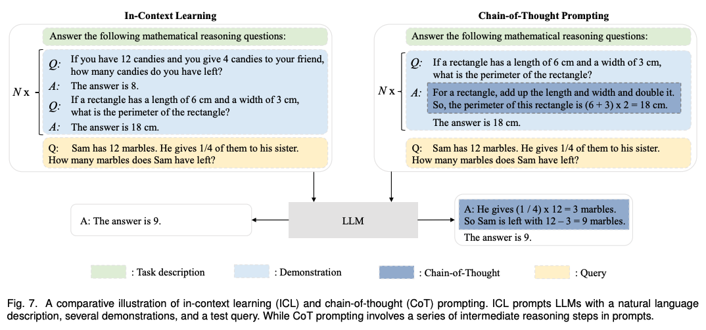

形式上，令$D_k = \{ f(x_1, y_1), . . . , f(x_k, y_k) \}$表示一组有k个例子的示例，其中$f(x_k, y_k)$是将第k个任务例子转化为自然语言提示的提示函数。 给定任务描述 I、示例$D_k$和一个新的输入查询$x_{k+1}$，从 LLM 生成的输出$y_{k+1}$的预测可以表述如下：
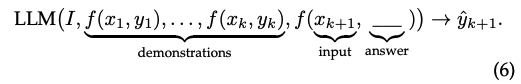

其中实际答案$y_{k+1}$被留空以供语言模型进行预测。由于交互式命令学习（ICL）的性能严重依赖于示例，因此合理设计prompt中的示例是一个重要问题。根据公式（6）中的构造过程，我们在prompt中对示例进行了三个主要方面的格式化处理，包括如何选择组成示例的例子，将每个例子使用函数$f(\cdot)$格式化为提示的形式，以及以合理的顺序安排示例。

在综述论文[A survey for in-context learning](https://arxiv.org/pdf/2301.00234.pdf)中对ICL进行了全面的回顾，我们建议读者参考该论文以获得更一般、更详细的讨论。与该综述相比，我们专门关注将ICL应用于LLM的两个主要方面的讨论，即示例设计和ICL的基本机制。此外，ICL与指令调整（在第5.1节中讨论）也有密切关联，因为两者都利用自然语言来格式化任务或实例。然而，指令调整需要对LLM进行微调以进行适应，而ICL仅通过prompt对LLM进行利用。此外，指令调整可以增强LLM执行目标任务的ICL能力，特别是在零样本设置下（仅使用任务描述）。
#### 6.1.2 示例设计（Demonstration Design）
多项研究表明，ICL的有效性在很大程度上受到示例设计的影响。根据第6.1.1节的讨论，我们将从三个主要方面介绍ICL的演示设计，即示例选择、格式和顺序。

* 示例选择。ICL的性能在不同的示例下往往存在较大的差异，因此选择一组能够有效利用LLM的ICL能力的示例子集是非常重要的。主要有两种演示选择方法，即启发式方法和基于LLM的方法：
	* 启发式方法。由于其简单性和低成本，现有的工作广泛采用启发式方法来选择演示示例。一些研究采用基于k-NN的检索器来选择与查询语义相关的示例。然而，它们通常针对每个示例进行选择，而不是对整个示例集进行评估。为了解决这个问题，提出了基于多样性的选择策略，用于选择特定任务的最具代表性的示例集。此外，在[Complementary Explanations for Effective In-Context Learning](https://arxiv.org/pdf/2211.13892.pdf)中，在选择示例时同时考虑了相关性和多样性。
	* 基于LLM的方法。另一种方法利用LLM来选择演示示例。例如，可以利用LLM直接衡量每个示例的信息量，即添加示例后的性能提升。此外，EPR提出了一种两阶段检索方法，首先使用无监督方法（如BM25）召回相似示例，然后使用经过LLM标注的正负示例训练的密集检索器对其进行排序。作为另一种方法，演示选择的任务可以被形式化为强化学习问题，其中LLM作为奖励函数提供反馈来训练策略模型。由于LLM在文本标注方面表现良好，一些最近的研究将LLM本身作为示例生成器，无需人工干预。

总结起来，如[An explanation of in-context learning as implicit bayesian inference](https://arxiv.org/pdf/2111.02080.pdf)所讨论的那样，ICL中选择的演示示例应该包含足够的关于待解决任务的信息，并且与测试查询相关，适用于上述两种选择方法。

* 示例格式。在选择任务示例之后，下一步是将它们整合并格式化为LLM的自然语言提示。一个直接的方法是使用相应的输入-输出对实例化预定义的模板。为了构建更具信息量的模板，最近的研究考虑添加任务描述或者使用思维链式prompt来增强LLM的推理能力。例如，在[Cross-Task Generalization via Natural Language Crowdsourcing Instructions](https://arxiv.org/pdf/2104.08773.pdf)中，作者收集了一个由人类撰写的带有任务描述的大规模数据集。在使用该数据集进行调整后，可以提升在已见任务上的性能，并且LLM在某种程度上也可以推广到未见任务。为了降低注释成本，在[Self-instruct](https://arxiv.org/pdf/2212.10560.pdf)中提出了一种半自动化方法，通过使用由人类编写的任务描述组成的种子集来引导LLM生成新任务的任务描述。由于对不同任务手动注释演示格式成本较高，一些工作也研究如何自动生成高质量的示例格式。作为两种代表性方法，Auto-CoT利用零样本提示“让我们一步一步地思考”来利用LLM生成中间推理步骤，而least-to-most prompting首先查询LLM进行问题分解，然后利用LLM根据先前解决问题的中间答案顺序解决子问题。
* 示例顺序。LLM有时会受到近期偏见的影响，即它们很容易重复出现在示例结束附近的答案。因此，合理安排示例的顺序非常重要。早期的研究提出了几种启发式方法来快速找到一个良好的顺序。例如，可以根据示例在嵌入空间中与查询的相似性直接组织示例：越相似，越靠近结束位置。此外，全局和局部熵指标可以用来评估不同的演示顺序。为了整合更多的任务信息，一些最近的研究提出了通过最小化压缩和传输任务标签所需的码长来启发，这受到了信息论的启发。然而，这些方法需要额外的带标签数据作为验证集来评估特定的演示顺序的性能。为了消除这种需求，有论文提出了从LLM自身中对验证数据进行采样的方法。

#### 6.1.3 底层机制
在预训练之后，LLM可以展示出有趣的ICL能力，而无需更新。接下来，我们将讨论关于LLM的ICL能力的两个关键问题，即“预训练如何影响ICL能力”和“LLM在推理过程中如何执行ICL”。

* 预训练如何影响ICL能力？ICL首次在GPT-3中提出，并且已经表明，随着模型规模的增大，ICL能力变得更加显著。然而，一些研究揭示了即使在小规模的PLM中，通过特殊设计的训练任务（例如，使用任务示例和查询作为输入来学习预测标签）也可以展示出强大的ICL能力，并且甚至可能超过更大的模型。这表明训练任务的设计是影响LLM的ICL能力的重要因素。除了训练任务，最近的研究还研究了ICL与预训练语料库之间的关系。研究表明，ICL的性能在很大程度上取决于预训练语料库的来源而不是规模。另一项研究对训练数据分布的影响进行了深入分析。他们发现，当训练数据可以被聚类为许多不常见的类别时，ICL就会出现，而不是均匀分布。此外，有论文从理论上解释了ICL是在表现出长程连贯性的文档上进行预训练的结果。
* LLM如何执行ICL？在推理阶段，研究人员关注分析ICL能力在给定演示的基础上是如何运作的，因为不涉及显式的学习或更新过程。他们通常从梯度下降的角度进行分析，并将ICL视为隐式的微调过程。在这个框架下，ICL过程可以解释如下：通过前向计算，LLM根据示例生成与示例相关的元梯度，并通过注意机制隐式执行梯度下降。实验证明，LLM中的某些注意力头能够执行与任务无关的原子操作（例如，复制和前缀匹配），这与ICL能力密切相关。为了进一步探索ICL的工作机制，一些研究将ICL抽象为一种算法学习过程。具体而言，[What learning algorithm is in-context learning? investigations with linear models](https://arxiv.org/pdf/2211.15661.pdf)的作者发现，在预训练期间，LLM通过其参数实质上对隐式模型进行编码。通过ICL提供的示例，LLM可以在前向计算过程中实现学习算法，如梯度下降，或直接计算封闭形式的解来更新这些模型。在这个解释框架下，已经证明LLM可以通过ICL有效地学习简单的线性函数，甚至一些复杂的函数，如决策树。

### 6.2 思维链（Chain-of-Thought）
链式思考（CoT）是一种改进的提示策略，旨在提高LLM在复杂推理任务上的性能，如算术推理
、常识推理和符号推理。与ICL中简单地使用输入-输出对构建提示不同，CoT将可以导致最终输出的中间推理步骤纳入到提示中。接下来，我们将详细介绍在ICL中使用CoT的方法，并讨论CoT提示何时以及为何起作用。
#### 6.2.1 使用CoT进行情境学习
通常情况下，CoT可以与ICL结合在两个主要的设置中，即少样本和零样本设置，如下所介绍。

* 少样本的CoT。少样本的CoT是ICL的一种特殊情况，通过将CoT的推理步骤纳入每个示例<input, output>中，扩充为<input, CoT, output>。为了应用这种策略，接下来我们将讨论两个关键问题，即如何设计适当的CoT提示和如何利用生成的CoT推导出最终答案。
	* CoT提示设计。设计合适的CoT提示对于有效激发LLM的复杂推理能力至关重要。直接的方法是使用多样的CoT（即每个问题的多个推理路径），可以有效提升性能。另一个直观的想法是，具有更复杂推理路径的提示更有可能引发LLM的推理能力，从而在生成正确答案方面具有更高的准确性。然而，这两种方法都依赖于注释的CoT数据集，限制了它们在实践中的应用。为了克服这个限制，Auto-CoT提议利用Zero-shot-CoT（在下一部分“零样本CoT”中详细介绍）通过特殊的提示LLM生成CoT推理路径，从而消除了人工工作。为了提高性能，Auto-CoT进一步将训练集中的问题分成不同的簇，并选择与每个簇的中心最接近的问题，这被认为能够很好地代表训练集中的问题。虽然少样本CoT可以被视为ICL中特殊的提示情况，但与ICL中的标准prompt相比，示例的顺序似乎影响相对较小：重新排序示例仅导致大多数任务的性能变化不超过2%。
	* 增强的CoT策略。除了丰富上下文信息外，CoT提示还为在给定问题时推断答案提供了更多选项。现有的研究主要集中在生成多个推理路径，并尝试在得出的答案中找到共识。例如，当生成CoT和最终答案时，提出了自一致性作为一种新的解码策略。它首先生成多个推理路径，然后对所有答案进行融合（例如，通过在这些路径之间投票选择最一致的答案）。自一致性较大幅度地提升了CoT推理的性能，甚至可以改善一些任务，在这些任务中，CoT提示通常比标准prompt差（例如，闭卷问题回答和自然语言推理）。此外，一篇论文将自一致性策略扩展到更通用的集成框架（扩展到对prompt的集成），并发现多样的推理路径是改善CoT推理性能的关键。上述方法可以很容易地集成到CoT提示中以提高性能，无需额外的训练。相反，其他研究则训练一个评分模型来衡量生成的推理路径的可靠性，或者持续地在自己生成的推理路径上训练LLM以改善性能。
* 零样本CoT。与少样本CoT不同，零样本CoT在提示中不包括人工标注的任务示例。相反，它直接生成推理步骤，然后利用生成的CoT来得出答案。零样本CoT最初在[Large Language Models are Zero-Shot Reasoners](https://arxiv.org/pdf/2205.11916.pdf)中提出，其中LLM首先通过“让我们逐步思考”进行提示，生成推理步骤，然后通过“因此，答案是”进行提示，得出最终答案。他们发现，当模型规模超过一定大小时，这种策略显著提高了性能，但在小规模模型上效果不佳，显示出了显著的新兴能力模式。为了在更多任务上发挥CoT能力，Flan-T5和Flan-PaLM进一步对CoT注释进行指令调整，并改善了在未见任务上的零样本性能。

#### 6.2.2 CoT的更多讨论
在这部分中，我们对与CoT相关的两个基本问题进行讨论，即“CoT在LLM中何时起作用”和“为什么LLM能够进行CoT推理”。
* CoT何时对LLM起作用？由于CoT是一种涌现能力[31]，它只对足够大的模型产生积极影响（例如，通常包含10亿个或更多参数的模型），而对小型模型则没有影响。此外，由于CoT通过引入中间推理步骤来增强标准prompt，它主要对需要逐步推理的任务产生积极效果，例如算术推理、常识推理和符号推理。然而，对于不依赖复杂推理的其他任务，CoT可能表现比标准提示更差，例如GLUE中的MNLI-m/mm、SST-2和QQP任务。有趣的是，CoT提示带来的性能提升似乎只在标准提示表现不佳时显著。
* 为什么LLM能够进行CoT推理？作为第二个问题，我们从以下两个方面讨论CoT的基本机制。
	* CoT能力的来源。关于CoT能力的来源，有广泛的假设认为它可以归因于对代码的训练，因为在代码上训练的模型表现出强大的推理能力。直观上，代码数据以算法逻辑和编程流程进行了良好的组织，这可能有助于改进LLM的推理性能。然而，这个假设仍缺乏公开报告的消融实验证据（包括使用和不使用代码训练）。此外，指令调整似乎不是获得CoT能力的关键原因，因为经验证明，在非CoT数据上进行的指令调整并不能提高在保留的CoT基准测试上的性能。
	* prompt组成部分的影响。CoT提示和标准提示之间的主要区别在于在最终答案之前加入了推理路径。因此，一些研究人员研究了推理路径中不同组成部分的影响。具体而言，最近的一项研究确定了CoT提示中的三个关键组成部分，即符号（例如算术推理中的数值数量）、模式（例如算术推理中的方程）和文本（即不是符号或模式的其余标记）。研究表明，后两个部分（即模式和文本）对模型的性能至关重要，删除其中任何一个都会导致显著的性能下降。然而，符号和模式的正确性似乎并不关键。此外，文本和模式之间存在共生关系：文本有助于LLM生成有用的模式，而模式则有助于LLM理解任务并生成有助于解决任务的文本。

总而言之，CoT提示提供了一种通用而灵活的方法来激发LLM的推理能力。还有一些初步的尝试将这种技术扩展到解决多模态任务和多语言任务。除了直接利用ICL和CoT的LLM，一些最近的研究还探索了如何使LLM的能力专门用于特定任务，这被称为模型专业化。例如，一些研究人员通过在LLM生成的CoT推理路径上对小型Flan-T5进行微调来专门处理数学推理的能力。模型专业化还可以应用于解决各种任务，如问答、代码合成和信息检索。

## 7. 能力评估
为了检验LLM的效果和优越性，已经利用了大量任务和基准来进行实证评估和分析。我们首先介绍LLM在语言生成和理解方面的三种基本评估任务类型，然后介绍几种具有更复杂设置或目标的LLM的高级任务，并最后讨论现有的基准和实证分析。

### 7.1 基础评价任务
在本部分，我们主要关注LLM的三种评估任务类型，即语言生成、知识利用和复杂推理。需要注意的是，我们并不打算对所有相关任务进行全面覆盖，而是只关注LLM最广泛讨论或研究的任务。接下来，我们详细介绍这些任务。
#### 7.1.1 语言生成
根据任务的定义，关于语言生成的现有任务可以大致分为语言建模、有条件文本生成和代码合成任务。需要注意的是，代码合成并不是一个典型的自然语言处理任务，我们将其包含在讨论中是因为一些LLM（在代码数据上进行训练）可以直接采用类似于生成自然语言文本的方法来解决该任务。

* 语言建模。作为LLM最基本的能力，语言建模旨在基于前面的标记预测下一个标记，主要关注基本语言理解和生成的能力。为了评估这种能力，现有工作使用的典型语言建模数据集包括Penn Treebank、WikiText-103和Pile，其中使用困惑度作为评估模型在zero-shot设置下的性能的常见指标。实证研究表明，LLM在这些评估数据集上相较于先前的最先进方法带来了显著的性能提升。为了更好地测试LLM在文本的长程依赖建模能力，引入了LAMBADA数据集，在该数据集中，LLM需要基于段落上下文预测句子的最后一个词。然后，使用预测的最后一个词的准确率和困惑度来评估LLM的性能。正如现有工作所示，语言建模任务的性能通常遵循缩放定律，这意味着扩展语言模型会提高准确性并降低困惑度。
* 条件文本生成。作为语言生成的重要领域，条件文本生成侧重于根据给定的条件生成满足特定任务要求的文本，典型的任务包括机器翻译、文本摘要和问答系统等。为了评估生成文本的质量，通常使用自动评估指标（如准确率、BLEU和ROUGE等）以及人工评分来评估模型的性能。由于具备强大的语言生成能力，LLM在现有的数据集和基准测试中取得了显著的成绩，甚至超过了人类的表现（在测试数据集上）。例如，仅使用32个示例作为输入，具有上下文学习的GPT-3在SuperGLUE的平均得分上可以超过完整数据微调的BERT-Large；在MMLU上，使用5个示例的Chinchilla的平均准确率几乎是人类评分者的两倍，而使用5个示例的GPT-4在准确率上进一步实现了最先进的性能，相比之前最好的模型，平均准确率提高了10%以上。因此，这引发了对现有条件文本生成任务的评估和反映LLM能力是否恰当的严重关切。针对这个问题，研究人员尝试通过收集当前无法解决的任务（即LLM在这些任务上表现不佳）或创建更具挑战性的任务（例如超长文本生成）来创建新的评估基准（例如BIG-bench Hard）。此外，最近的研究还发现自动评估指标可能低估了LLM的生成质量。在OpenDialKG中，ChatGPT在BLEU和ROUGE-L指标上表现不如微调的GPT-2，但在人工评判中获得更多好评。因此，需要更多的工作来开发更符合人类判断的新指标。
* 代码合成。除了生成高质量的自然语言外，现有的LLM还展现出生成形式语言的强大能力，特别是满足特定条件的计算机程序（即代码）的生成，称为代码合成。与自然语言生成不同，由于生成的代码可以直接通过相应的编译器或解释器执行进行检查，现有的工作主要通过计算LLM生成的代码在测试用例中的通过率（pass@k）来评估生成的代码的质量。最近，提出了几个着重于功能正确性的代码基准来评估LLM的代码合成能力，例如APPS、HumanEval和MBPP。这些基准通常包含各种编程问题，包括文本规范和用于检查正确性的测试用例。为了提高这种能力，关键是对LLM进行代码数据的微调（或预训练），这可以有效地使LLM适应代码合成任务。此外，现有的工作还提出了生成代码的新策略，例如采样多个候选解决方案和规划引导解码，这可以被视为程序员进行错误修复和代码规划过程的模仿。令人印象深刻的是，LLM最近在编程竞赛平台Codeforces上的用户排名中达到了前28%的竞争水平。此外，GitHub Copilot已发布，可在编码IDE（如Visual Studio和JetBrains IDE）中辅助编程，支持包括Python、JavaScript和Java在内的多种语言。《ACM通讯》杂志上一篇名为《编程的终结》（The End of Programming）的观点文章讨论了人工智能编程在计算机科学领域的影响，强调了向高度自适应的LLM作为新的计算原子的重要转变。
* 主要问题。尽管LLM在生成类似人类的文本方面取得了出色的性能，但在语言生成方面，它们容易受到以下两个主要问题的影响。
	* 可控生成。对于LLM来说，生成符合给定条件的文本的主流方法是使用自然语言指令或提示。尽管这种机制简单，但在对这些模型生成的输出施加细粒度或结构性约束方面存在重大挑战。现有的研究表明，当在文本结构上施加复杂约束时，LLM在处理局部规划（例如相邻句子之间的交互）方面表现非常出色，但在全局规划（即长距离关联）方面可能遇到困难。例如，要生成一个包含多个段落的复杂长篇章，仍然很难直接确保特定的文本结构（例如概念的顺序和逻辑流程），考虑到整个文本。对于需要遵循形式规则或语法的生成任务（例如代码合成），这种情况将变得更具挑战性。解决这个问题的一个潜在解决方案是将一次性生成扩展为对LLM的迭代提示。这模拟了人类的写作过程，将语言生成分解为计划、起草、重写和编辑等多个步骤。几项研究证明，迭代提示可以唤起相关知识，以在子任务中实现更好的性能。实质上，思维链提示已经利用了将复杂任务分解为多步推理链的思想。此外，生成文本的安全控制对于实际部署也很重要。已经显示LLM可能生成包含敏感信息或冒犯性表达的文本。虽然RLHF算法在一定程度上可以缓解这个问题，但它仍然依赖于大量的人工标记数据来调整LLM，而没有一个明确的优化目标。因此，迫切需要探索有效的方法来克服这些限制，并对LLM的输出进行更安全的控制。
	* 专业化生成。尽管LLM已经学习了生成连贯文本所需的通用语言模式，但当处理专门领域或任务时，它们在生成方面的能力可能受到限制。例如，一个在通用网络文章上训练的语言模型在生成涉及许多医学术语和方法的医疗报告时可能面临挑战。直观地说，领域知识对于模型的专业化至关重要。然而，将这种专业化知识注入LLM并不容易。正如最近的分析所讨论的，当LLM被训练以展示某些特定的能力，使它们在某些领域表现出色时，它们可能在其他领域遇到困难。这个问题与神经网络训练中的灾难性遗忘相关，灾难性遗忘指的是整合新旧知识的冲突现象。类似的情况也发生在LLM的人类对齐中，其中“对齐成本”（例如在上下文学习能力中可能存在的损失）必须为了与人类价值观和需求对齐而支付。因此，开发有效的模型专业化方法非常重要，这些方法可以灵活地使LLM适应各种任务场景，同时尽可能保留原有的能力。

#### 7.1.2 知识运用
知识利用是智能系统完成知识密集型任务（例如常识问答和事实补全）的重要能力，它基于支持性事实证据。具体而言，它要求LLM在必要时能够正确利用来自预训练语料库的丰富事实知识或检索外部数据。特别是问题回答（QA）和知识补全已经成为评估这种能力的两种常用任务。根据测试任务（问题回答或知识补全）和评估设置（是否使用外部资源），我们将现有的知识利用任务分为三种类型，即闭卷QA、开卷QA和知识补全。

* 闭卷QA。闭卷QA任务测试LLM从预训练语料库中获得的事实知识，LLM应仅基于给定的上下文回答问题，不使用外部资源。为了评估这种能力，可以利用几个数据集，包括Natural Questions 、Web Questions和TriviaQA，其中广泛采用准确性指标。实证结果表明，LLM在这个设置下表现良好，甚至能够与最先进的开放领域QA系统的性能相媲美。此外，LLM在闭卷QA任务上的表现也展现出模型规模和数据规模方面的扩展规律：增加参数和训练标记可以增加LLM的容量，并帮助其从预训练数据中学习（或记忆）更多知识。此外，在相似的参数规模下，LLM使用与评估任务相关的更多预训练数据将获得更好的性能。此外，闭卷QA设置还提供了一个测试平台，用于探究LLM编码的事实知识的准确性。然而，正如现有研究所示，LLM在依赖细粒度知识的QA任务上可能表现不佳，即使这些知识存在于预训练数据中。
* 开卷QA。与闭卷QA不同，在开卷QA任务中，LLM可以从外部知识库或文档集合中提取有用的证据，然后基于提取的证据回答问题。典型的开卷QA数据集（例如Natural Questions、OpenBookQA和SQuAD）与闭卷QA数据集有重叠，但它们包含了外部数据源，例如维基百科。在开卷QA任务中，广泛使用准确性和F1分数作为评估指标。为了从外部资源中选择相关知识，LLM通常与文本检索器（甚至搜索引擎）配对使用，该检索器可以独立训练，也可以与LLM联合训练。在评估中，现有研究主要关注LLM如何利用提取的知识来回答问题，并表明提取的证据可以大大提高生成答案的准确性，甚至使较小的LLM表现优于10倍大的模型。此外，开卷QA任务还可以评估知识信息的时效性。从过时的知识资源进行预训练或检索可能导致LLM对于时间敏感的问题生成错误答案。
* 知识补全。在知识补全任务中，LLM在某种程度上可以被视为一个知识库，用于完成或预测知识单元（例如知识三元组）的缺失部分。这样的任务可以探索和评估LLM从预训练数据中学到了多少以及什么类型的知识。现有的知识补全任务可以大致分为知识图谱补全任务（例如FB15k237和WN18RR）和事实补全任务（例如WikiFact），它们分别旨在完成知识图谱中的三元组和有关特定事实的不完整句子。实证研究表明，现有的LLM很难完成与特定关系类型相关的知识补全任务。在WikiFact的评估结果中，LLM在一些在预训练数据中经常出现的关系（例如货币和作者）上表现良好，而在罕见的关系（例如发现者或发明者和出生地）上表现不佳。有趣的是，在相同的评估设置下（例如在上下文学习中），InstructGPT（即text-davinci-002）在WikiFact的所有子集中表现优于GPT-3。这表明指令调整对于LLM完成知识补全任务是有帮助的。
* 主要问题。尽管LLM在捕捉和利用知识信息方面取得了重要进展，但它们仍然存在两个主要问题，如下所讨论。
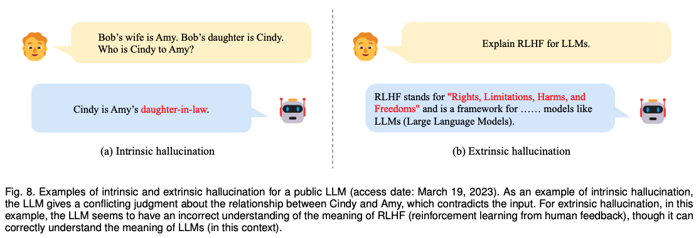
	* 幻觉。在生成事实性文本时，一个具有挑战性的问题是幻觉生成，即生成的信息与现有来源相冲突（内在幻觉）或无法通过可用来源进行验证（外在幻觉），这在图8的两个例子中有所说明。幻觉在现有的LLM中普遍存在，即使是最优秀的LLM（如GPT4）也不例外。从本质上讲，LLM似乎“无意识地”在任务求解中利用了知识，但它们仍然缺乏准确控制内部或外部知识使用的能力。幻觉会导致LLM生成不符合预期的输出，严重降低性能，并在将LLM部署到实际应用中时带来潜在风险。为了缓解这个问题，现有工作广泛使用了对齐调整策略（如第5.2节所讨论的），依靠在高质量数据上调整LLM或利用人类反馈进行调整。为了评估幻觉问题，已经提出了一组幻觉检测任务，例如TruthfulQA，用于检测模型模仿的人类虚假言论。
	* 知识时效性。作为另一个主要挑战，LLM在解决需要超出训练数据的最新知识的任务时会遇到困难。解决这个问题的一个直接方法是定期使用新数据对LLM进行更新。然而，对LLM进行微调非常昂贵，并且在增量训练LLM时可能会导致灾难性遗忘问题。因此，有必要开发高效而有效的方法，将新知识整合到现有的LLM中，使其保持最新。现有研究已经探索了如何利用外部知识源（例如搜索引擎）来补充LLM，可以将其与LLM联合优化，或将其作为即插即用的模块。例如，ChatGPT利用检索插件访问最新的信息源。通过将提取的相关信息纳入上下文，LLM可以获取新的事实知识，并在相关任务上表现更好。然而，这种方法似乎仍然停留在表面层面。研究表明，直接修改内在知识或向LLM注入特定知识是困难的，这仍然是一个待解决的开放性研究问题。

#### 7.1.3 复杂推理
复杂推理是指理解和利用支持证据或逻辑来推导结论或做出决策的能力。根据推理过程中涉及的逻辑和证据类型，我们将现有的评估任务分为三个主要类别，即知识推理、符号推理和数学推理。

* 知识推理。知识推理任务依赖于逻辑关系和关于事实知识的证据来回答给定的问题。现有的工作主要使用特定的数据集来评估相应类型知识的推理能力，例如，用于常识知识推理的CSQA/StrategyQA和用于科学知识推理的ScienceQA。除了预测结果的准确性之外，现有工作还通过自动评估指标（例如BLEU）或人工评估来评估生成的推理过程的质量。通常，这些任务要求LLM基于事实知识进行逐步推理，直到找到给定问题的答案。为了激发逐步推理的能力，研究人员提出了链式思考（CoT）提示策略，以增强LLM的复杂推理能力。如第6.2节所讨论的，CoT涉及中间推理步骤，可以通过手动创建或自动生成，并将其作为提示信息引导LLM进行多步推理。这种方法极大地提高了LLM的推理性能，在几个复杂知识推理任务上取得了新的最先进结果。此外，研究人员在将知识推理任务改写为代码生成任务后发现，LLM的性能可以进一步提高，特别是对于在代码预训练的LLM上。然而，由于知识推理任务的复杂性，当前LLM的性能仍然落后于人类在常识推理等任务上的结果。作为最常见的错误之一，LLM可能会基于错误的事实知识生成不准确的中间步骤，从而导致错误的最终结果。为了解决这个问题，现有的工作提出了特殊的解码或集成策略来提高整个推理链的准确性。最近的一项实证研究表明，LLM可能难以明确推断出特定任务所需的常识知识，尽管它们可以成功解决该任务。此外，研究还显示，利用自动生成的知识可能对改进推理性能并不有益。
* 符号推理。符号推理任务主要关注在形式化规则设置中操纵符号以实现某个特定目标，其中在预训练期间LLM可能从未见过这些操作和规则。现有的工作通常在最后一个字母连接和抛硬币的任务上评估LLM，评估示例要求LLM进行与上下文示例相同的推理步骤（称为领域内测试）或更多的步骤（称为领域外测试）。对于领域外测试的示例，LLM只能看到上下文中有两个单词的示例，但需要求解LLM将三个或更多单词的最后一个字母进行连接。通常，采用生成的符号的准确性来评估LLM在这些任务上的性能。因此，LLM需要理解符号操作之间的语义关系以及在复杂场景中的组合方式。然而，在领域外设置下，由于LLM没有见过符号操作和规则的复杂组合（例如，上下文示例中操作的数量的两倍），LLM很难捕捉到它们的准确含义。为了解决这个问题，现有研究采用了草稿本和导师策略，以帮助LLM更好地操作符号操作，生成更长和更复杂的推理过程。另一方面，研究工作利用形式化编程语言表示符号操作和规则，要求LLM生成代码，并通过外部解释器执行来执行推理过程。这种方法可以将复杂的推理过程分解为LLM和解释器的代码合成和程序执行，分别导致简化的推理过程和更准确的结果。
* 数学推理。数学推理任务需要综合运用数学知识、逻辑和计算来解决问题或生成证明陈述。现有的数学推理任务主要可以分为数学问题求解和自动定理证明两类。对于数学问题求解任务，常用于评估的数据集包括SVAMP、GSM8k和MATH，在这些任务中，LLM需要生成准确的具体数字或方程来回答数学问题。由于这些任务也需要多步推理，链式思维提示策略已被广泛采用来提高LLM的推理性能。作为一种实用策略，将LLM持续进行大规模数学语料的预训练可以极大提升它们在数学推理任务上的表现。此外，由于不同语言中的数学问题共享相同的数学逻辑，研究人员还提出了一个多语言数学问题基准测试来评估LLM的多语言数学推理能力。自动定理证明（ATP）是另一个具有挑战性的任务，它要求推理模型严格遵循推理逻辑和数学技巧。为了评估在该任务上的表现，PISA和 miniF2F是两个典型的ATP数据集，其中证明成功率是评估指标。现有ATP研究的一个典型方法是利用LLM来辅助搜索证明，使用交互式定理证明器（ITP），如Lean、Metamath和Isabelle。ATP研究的一个主要限制是缺乏相关的形式语言语料库。为了解决这个问题，一些研究利用LLM将非正式陈述转化为形式证明来增加新的数据，或者生成草稿和证明草图来减小证明的搜索空间。
* 主要问题。尽管取得了进展，LLM在解决复杂推理任务方面仍然存在一些限制。
	* 不一致性。通过改进的推理策略（例如，CoT提示），LLM可以通过基于支持逻辑和证据的逐步推理来解决一些复杂推理任务。尽管有效，但在分解的推理过程中经常出现不一致性问题。具体而言，LLM可能会按照无效的推理路径生成正确答案，或者在正确的推理过程之后产生错误答案 ，导致推导出的答案与推理过程之间存在不一致。为了缓解这个问题，现有的工作提出了通过外部工具或模型来引导LLM的整个生成过程，或者重新检查推理过程和最终答案以进行纠正。作为一种有前景的解决方案，最近的方法将复杂推理任务重新定义为代码生成任务，通过生成的代码的严格执行确保推理过程和结果之间的一致性。此外，已经发现在具有相似输入的任务之间可能存在不一致性，任务描述的微小变化可能导致模型产生不同的结果。为了缓解这个问题，可以采用多个推理路径的集成来增强LLM的解码过程。
	* 数值计算。对于复杂推理任务，LLM在涉及数值计算方面仍然面临困难，特别是对于在预训练过程中很少遇到的符号，如大数运算 。解决这个问题的一种直接方法是在合成的算术问题上调整LLM的参数。一系列研究遵循这种方法，并通过特殊的训练和推理策略，如scratchpad追踪，进一步提高数值计算性能。此外，现有的工作还使用外部工具（如计算器）来处理算术运算。最近，ChatGPT提供了使用外部工具的插件机制。通过这种方式，LLM需要学习如何正确操作这些工具。为此，研究人员通过使用工具（甚至是LLM本身）增加了示例来调整LLM，或者设计了指导和示范以进行上下文学习。然而，这些LLM仍然依赖于文本上下文来捕捉数学符号的语义含义（在预训练阶段），这在本质上并不适合数值计算。

### 7.2 进阶能力评估
除了上述基本评估任务之外，LLM还展示了一些出色的能力，需要对其进行特殊考虑。在本部分，我们讨论几种代表性的高级能力及其相应的评估方法，包括与人类的对齐、与外部环境的交互以及工具操作。接下来，我们详细讨论这些高级能力。
#### 7.2.1 人类对齐
期望LLM能够与人类的价值和需求保持良好的一致性，即人类对齐（human alignment），这是LLM在实际应用中广泛使用的关键能力。

为了评估这种能力，现有研究考虑了多个人类对齐的标准，例如有用性、诚实性和安全性。对于有用性和诚实性，可以利用对抗性问答任务（如TruthfulQA）来检查LLM在检测文本中可能存在的虚假信息方面的能力。此外，无害性可以通过一些现有的基准数据集进行评估，例如CrowS-Pairs 和Winogender。尽管可以通过上述数据集进行自动评估，但人工评估仍然是一种更直接有效的方法来测试LLM的人类对齐能力。OpenAI邀请了许多与AI风险相关的领域专家对GPT-4在遇到风险内容时的行为进行评估和改进。此外，对于人类对齐的其他方面（例如真实性），一些研究提出使用具体的指导说明和设计注释规则来指导注释过程。实证研究表明，这些策略可以大大提高LLM的人类对齐能力。例如，在与专家进行互动收集数据并进行对齐调优后，GPT-4在处理敏感或不允许的提示时的错误行为率可以大幅降低。此外，高质量的预训练数据可以减少对齐所需的工作量。例如，由于科学语料库中内容较少偏见，Galactica在潜在的无害性方面可能更好一些。
#### 7.2.2 与外界环境交互
除了标准的评估任务之外，LLM还具备接收外部环境的反馈并根据行为指令执行动作的能力，例如生成自然语言中的行动计划来操作代理人。这种能力在LLM中也是新兴的，它可以生成详细而高度逼真的行动计划，而较小的模型（如GPT-2）往往会生成较短或毫无意义的计划。

为了测试这种能力，可以使用几个具身人工智能基准进行评估，如下所述。VirtualHome为家务任务（如清洁和烹饪）构建了一个3D模拟器，在其中代理人可以执行LLM生成的自然语言动作。ALFRED包括更具挑战性的任务，要求LLM完成组合性目标。BEHAVIOR侧重于模拟环境中的日常家务事，并要求LLM生成复杂的解决方案，例如改变物体的内部状态。基于LLM生成的行动计划，现有的研究要么采用基准中的常规指标（例如生成的行动计划的可执行性和正确性），要么直接进行真实世界实验并测量成功率，以评估这种能力。现有的研究已经显示了LLM在与外部环境进行交互和生成准确的行动计划方面的有效性。最近，还提出了一些改进的方法来增强LLM的交互能力，例如设计类似代码的prompt和提供真实世界的标准（ real-world grounding）。
#### 7.2.3 操作工具
在解决复杂问题时，当LLM确定有必要时，它们可以使用外部工具。通过使用API调用封装可用工具，现有的研究已经使用了各种外部工具，例如搜索引擎、计算器和编译器，以提升LLM在特定任务上的性能。最近，OpenAI在ChatGPT中支持了插件的使用，这可以为LLM提供超越语言模型的更广泛能力。例如，Web浏览器插件使ChatGPT能够访问最新的信息。此外，整合第三方插件对于创建基于LLM的繁荣应用生态系统尤为重要。

为了检验工具操作的能力，现有的研究主要采用复杂推理任务进行评估，如数学问题求解（例如GSM8k和SVAMP）或知识问答（例如TruthfulQA），在这些任务中，工具的成功利用对于增强LLM所无法胜任的技能（例如数值计算）非常重要。通过这种方式，对这些任务的评估表现可以反映出LLM在工具操作方面的能力。为了教导LLM如何利用工具，现有研究在上下文中添加了使用工具的示例来引导LLM，或者在模拟数据中对LLM进行微调，以让它们学会使用工具。现有的研究发现，在工具的帮助下，LLM变得更加擅长处理它们不擅长的问题，例如方程计算和利用实时信息，并最终提高了最终的性能。

总结：上述的三种能力对于LLM的实际表现具有重要价值：符合人类的价值观和偏好（人类对齐），在真实场景中表现恰当（与外部环境的交互），以及扩展能力范围（工具操作）。除了上述的三种高级能力之外，LLM还可能展示其他与特定任务（例如数据注释）或学习机制（例如自我改进）相关的能力。发现、衡量和评估这些新兴能力将是一个开放的方向，以便更好地利用和改进LLM。

### 7.3 公共基准与实证分析
在前面的部分中，我们已经讨论了LLM的评估任务及其相应的设置。接下来，我们将介绍针对LLM的现有评估基准和经验分析，重点是从一个更全面的视角进行探讨。
#### 7.3.1 评估基准
最近，已经发布了几个综合性的评估基准用于评估LLM。在这部分中，我们介绍几个代表性且广泛使用的基准，即MMLU、BIG-bench和HELM。

* MMLU是一个用于大规模评估多任务知识理解的通用基准，涵盖了从数学、计算机科学到人文社科等广泛的知识领域。这些任务的难度从基础到高级各不相同。现有研究显示，LLM在这个基准上的表现大多明显优于小型模型，这表明了模型规模的扩展规律。最近，GPT-4在MMLU中取得了显著的记录（在5-shot设置下达到了86.4%），明显优于之前的最先进模型。
* BIG-bench是一个协作基准，旨在从各个方面评估现有的LLM。它包含了204个任务，涵盖了广泛的主题，包括语言学、儿童发展、数学、常识推理、生物学、物理学、社会偏见、软件开发等等。通过增加模型规模，LLM甚至可以在BIG-bench的65%任务中在few-shot设置下超过平均人类表现。考虑到整个基准的高评估成本，还提出了一个轻量级基准 BIG-bench-Lite，其中包含了来自BIG-bench的24个小而多样且具有挑战性的任务。此外，还提出了 BIG-bench hard (BBH) 基准，重点研究LLM在一些任务上无法解决的问题，选择LLM表现相对人类较差的具有挑战性的任务进行调查。由于BBH更加困难，小型模型的表现大多接近随机。作为对比，通过CoT提示可以引发LLM进行逐步推理的能力，从而提高性能，甚至在BBH中超过了平均人类表现。
* HELM是一个综合性基准，目前实施了16个核心场景和7个指标类别。它构建在许多先前的研究基础上，对语言模型进行了全面评估。如HELM的实验结果所示，指导调优可以在准确性、鲁棒性和公平性方面持续提升LLM的性能。此外，在推理任务中，预训练于代码语料库的LLM表现出更优秀的性能。

上述基准涵盖了LLM评估的各种主流任务。此外，还有一些专注于评估LLM特定能力的基准，例如TyDiQA用于多语言知识利用，MGSM用于多语言数学推理。为了进行评估，可以根据具体目标选择合适的基准。此外，还有一些开源的评估框架供研究人员在现有基准上评估LLM或扩展新任务进行定制化评估，例如Language Model Evaluation Harness和OpenAI Evals。

#### 7.3.2 LLM的综合能力分析
除了构建大规模评估基准，还有大量的研究进行了综合分析，以探究LLM的优势和局限性。在这部分中，我们将从总体能力（通用性）和专家能力（领域特定性）两个主要方面对它们进行简要讨论。

* 通用能力。由于其卓越的性能，现有的研究系统地评估了LLM的通用能力，探索它们在各种不同任务或应用中的能力。通常，这些研究主要关注新出现的LLM（例如ChatGPT和GPT-4），这些模型以前尚未得到深入研究，下面将对其进行讨论：

	* 熟练度。为了评估LLM在解决一般任务中的熟练度，现有研究通常收集一组涵盖各种任务和领域的数据集，然后在少量/零样本设置下对LLM进行测试。实证结果表明，LLM作为通用任务求解器具有优越的能力。作为一个显著的进展，GPT-4在许多任务中超越了基准特定训练的最新方法，如语言理解、常识推理和数学推理。此外，它还可以在针对人类设计的真实考试（例如高级放置考试和研究生入学考试）中实现类人的表现。最近，一项全面的定性分析揭示了GPT-4在各个领域（如数学、计算机视觉和编程）的各种具有挑战性的任务中接近人类水平的表现，并被认为是“一个人工通用智能系统的早期版本”。尽管有着令人期待的结果，这项分析还揭示了GPT-4仍然存在严重的局限性。例如，GPT-4很难校准其对生成结果的置信度，并且无法验证其与训练数据和自身的一致性。此外，它在需要规划的任务（如解决“汉诺塔”问题）或概念跃迁的任务（如提出新的科学假设）上表现出较差的性能。此外，几项研究还显示，LLM在特定领域的信息提取任务中可能会误解陌生概念，在解决与实用情感相关的任务（例如个性化情感识别）时面临挑战，表现出较特定的微调模型的性能较差。
	* 鲁棒性。除了熟练度外，另一个需要考虑的方面是LLM对噪声或扰动的稳定性，这对于实际应用尤为重要。为了评估LLM对噪声或扰动的鲁棒性，现有研究对输入进行对抗攻击（如令牌替换），然后根据输出结果的变化评估LLM的鲁棒性。研究表明，LLM在各种任务中比小型语言模型更具鲁棒性，但可能会遇到鲁棒性不稳定和prompt敏感性等新问题。具体而言，LLM在使用相同输入的不同表达时往往会给出不同的答案，甚至与自己生成的内容相冲突。这个问题也会导致在使用不同提示进行鲁棒性评估时产生不稳定的结果，使得鲁棒性分析的评估结果本身不太可靠。
* 专家领域。由于LLM在大规模混合源语料库上进行了预训练，它们可以从预训练数据中获取丰富的知识。因此，LLM也被用作特定领域的领域专家。因此，最近的研究广泛探索了使用LLM解决特定领域任务并评估LLM的适应能力。通常，这些研究收集或构建特定领域的数据集，通过上下文学习评估LLM的性能。由于我们的重点不是涵盖所有可能的应用领域，我们简要讨论了研究界关注的三个代表性领域，即医疗、教育和法律。
	* 医疗保健是一个与人类生命密切相关的重要应用领域。自ChatGPT问世以来，一系列研究已经将ChatGPT或其他LLM应用于医疗领域。研究表明，LLM能够处理各种医疗任务，例如生物信息提取、医疗咨询和报告简化，甚至可以通过专门设计给专业医生的医疗执照考试。然而，LLM可能会编造医疗虚假信息，例如错误解释医学术语并提供与医学指南不一致的建议。此外，上传患者的健康信息也会引起隐私担忧。
	* 教育是另一个重要的应用领域，LLM在其中可能产生重大影响。现有研究发现，LLM在数学、物理、计算机科学等科目的标准化考试中可以达到学生水平的表现，包括选择题和自由回答问题。此外，经验证实，LLM可以作为教育领域的写作或阅读助手。最近的一项研究表明，ChatGPT能够在不同学科中生成逻辑一致的答案，兼顾深度和广度。另一项定量分析显示，利用ChatGPT的学生在计算机安全领域的某些课程中表现优于平均学生，尤其是在使用方法上不同（例如保留或完善LLM生成的结果作为自己的答案）。然而，LLM的日益普及也引发了对合理使用此类智能助手进行教育的担忧（例如作业作弊）。
	* 法律是一个建立在专业领域知识上的专业领域。最近，许多研究将LLM应用于解决各种法律任务，例如法律文件分析、法律判断预测和法律文件撰写。最近的一项研究发现，LLM具有强大的法律解释和推理能力。此外，最新的GPT-4模型在模拟律师资格考试中的得分在与人类考生相比中排名前10%。然而，LLM在法律领域的使用也引发了一些法律挑战的关注，包括版权问题、个人信息泄露以及偏见和歧视等。

除了上述工作，还从其他角度分析了LLM的能力。例如，最近的一些研究探讨了LLM的人类特征，如自我意识、心理理论和情感计算。特别是，在对两个经典的虚假信念任务进行的ToM（心智理论）的实证评估中，LLM被认为具有类似ToM的能力，因为GPT-3.5系列模型在ToM任务中的表现与九岁儿童相当。此外，另一方面的研究调查了现有LLM评估设置的公平性和准确性，例如，大规模混合源预训练数据可能包含测试集中的数据。

## 8. 总结和展望
在这篇综述中，我们回顾了大语言模型(LLM)的最新进展， 并介绍了理解和利用LLM的关键概念、发现和技术。我们重点关注大模型(即大小超过10B的模型)，并未考虑与早期预训练语言模型(例如BERT和GPT-2)的相关内容，因为它们已经在现有文献中得到了很好的综述。具体来说，我们的综述讨论了LLM的四个重要方面，即预训练、适配微调、应用和评估。针对每个方面，我们重点介绍了对LLM成功至关重要的技术或发现。此外，我们还总结了开发LLM的可用资源，并讨论了实现LLM的重要技术，以便复现LLM。这篇综述试图涵盖关于LLM的最新文献，并为研究人员和工程师提供一份有关这个主题的优质参考资料。接下来，我们总结了本文的讨论，并在以下方面介绍了LLM的挑战和未来方向。
#### 理论与原则
为了理解LLM的工作机制，其中一个最大的谜团是信息如何通过庞大而深层的神经网络进行分布、组织和利用。揭示建立LLM能力基础的基本原理或元素非常重要。特别是，缩放似乎在增加LLM的能力方面起着重要作用。研究表明，当语言模型的参数规模增加到一个临界大小（例如10B）时，一些新出现的能力会以意想不到的方式出现（突然的性能提升），通常包括上下文学习、指令跟随和逐步推理等。这些新出现的能力令人着迷但也令人困惑：LLM何时以及如何获得这些能力尚不清楚。最近的研究要么进行大量实验来调查新出现的能力的影响和导致这些能力的因素，要么用现有的理论框架解释一些具体的能力。一篇富有洞察力的技术文章还专门讨论了这个问题，以GPT系列模型为目标。然而，目前还缺乏更正式的理论和原则来理解、描述和解释LLM的能力或行为。由于新出现的能力与自然界中的相变现象具有密切的类比关系，跨学科的理论或原则（例如，LLM是否可以被视为某种复杂系统）可能有助于解释和理解LLM的行为。这些基本问题值得研究界探索，对于开发下一代LLM非常重要。
#### 模型架构
由于可扩展性和有效性，Transformer成为构建LLM的事实上的架构，它由堆叠的多头自注意力层组成。已经提出了各种策略来改进这个架构的性能，例如神经网络配置和可扩展的并行训练（参见4.2.2节的讨论）。为了增强模型的容量（例如多轮对话能力），现有的LLM通常保持一个较长的上下文窗口，例如GPT-4-32k具有非常大的上下文长度，达到32,768个标记。因此，一个实际的考虑是减少标准自注意力机制产生的时间复杂度（原本是二次成本）。研究更高效的Transformer变体在构建LLM方面的效果非常重要，例如稀疏注意力已经在GPT-3中使用过。此外，灾难性遗忘一直是神经网络的一大挑战，这也对LLM产生了负面影响。当使用新数据调整LLM时，原先学到的知识可能会受损，例如，根据特定任务对LLM进行微调将影响LLM的通用能力。当LLM与人类价值观保持一致时（称为对齐税），也会出现类似情况。因此，有必要考虑通过更灵活的机制或模块来扩展现有架构，以有效支持数据更新和任务专业化。
#### 模型训练
在实践中，由于巨大的计算消耗和对数据质量和训练技巧的敏感性，预训练能力强的LLM变得非常困难。因此，开发更系统化、经济高效的预训练方法，以优化LLM，考虑模型的有效性、效率优化和训练稳定性因素变得尤为重要。需要开发更多的模型检查或性能诊断方法（例如GPT-4中的可预测缩放），以便在训练过程中及早发现异常问题。此外，还需要更灵活的硬件支持机制或资源调度机制，以更好地组织和利用计算集群中的资源。由于从头开始预训练LLM成本非常高昂，因此设计一种适合的机制，可以基于公开可用的模型检查点（例如LLaMA和Flan-T5）持续进行预训练或微调LLM非常重要。为此，需要解决一系列技术问题，例如灾难性遗忘和任务专业化。然而，到目前为止，尚缺乏具有完整预处理和训练日志（例如准备预训练数据的脚本）的LLM开源模型检查点，以便进行复现。我们相信，在LLM的研究中，报告更多的技术细节对开源模型的发展具有重要价值。此外，还需要开发更多的改进调优策略，以有效地激发模型的能力。
#### 模型应用
由于在实际应用中进行微调非常昂贵，提示已成为使用LLM的主要方法。通过将任务描述和示例演示组合成提示，上下文学习（一种特殊的提示形式）赋予LLM在新任务上表现出色的能力，甚至在某些情况下超越完整数据微调模型的性能。此外，为了增强复杂推理能力，已经提出了先进的提示技术，例如思维链（CoT）策略，该策略将中间推理步骤包含在提示中。然而，现有的提示方法仍然存在以下几个不足之处。首先，它需要相当大的人力投入来设计提示。自动生成解决各种任务的有效提示将非常有用。其次，一些复杂的任务（例如形式证明和数值计算）需要特定的知识或逻辑规则，这些规则可能无法很好地用自然语言表达或通过示例演示。因此，开发更具信息量和灵活性的任务格式化方法对于提示非常重要。第三，现有的提示策略主要关注单轮性能。为解决复杂任务，开发交互式提示机制（例如通过自然语言对话）非常有用，ChatGPT已经证明了其非常实用性。
#### 安全性和对齐
尽管LLM具有强大的能力，但它们与小型语言模型一样面临着类似的安全挑战。例如，LLM存在生成错觉的倾向，即看似合理但可能事实不准确的文本。更糟糕的是，LLM可能会受到有意的指令激发，产生有害、偏见或有毒的文本，从而导致潜在的滥用风险。关于LLM的安全问题（如隐私、过度依赖、虚假信息和影响操作），读者可以参考GPT-3/4的技术报告进行详细讨论。作为避免这些问题的主要方法，通过人类反馈进行强化学习（RLHF）已经广泛应用，通过将人类纳入训练过程中以开发与人类价值观相一致的LLM。为了提高模型的安全性，在RLHF过程中还很重要地包含与安全相关的提示，正如GPT-4所示。然而，RLHF严重依赖于来自专业标注人员的高质量人类反馈数据，使得在实践中难以得到适当实施。因此，有必要改进RLHF框架，以减少标注人员的工作量，并寻求一种更高效的注释方法，保证数据质量，例如可以利用LLM来辅助标注工作。最近，红队测试已经被采用来提高LLM的模型安全性，它利用收集到的对抗性提示来改进LLM（即避免来自红队测试的攻击）。此外，建立适当的学习机制，使LLM通过聊天获得人类反馈并直接利用它进行自我改进，也具有重要意义。
#### 应用和生态系统
由于LLM在解决各种任务方面展现出强大的能力，它们可以应用于广泛的实际应用领域（即按照任务特定的自然语言指令进行操作）。作为一个显著的进展，ChatGPT在改变人们获取信息的方式方面具有潜在的影响，这已经在新版Bing搜索引擎中得到了实现。在不久的将来，可以预见LLM将对信息搜索技术产生重大影响，包括搜索引擎和推荐系统。此外，随着LLM技术的升级，智能信息助手的开发和使用也将得到大力推动。在更广泛的范围内，这一技术创新浪潮将引导出以LLM为核心的应用生态系统（例如ChatGPT的插件支持），与人类生活密切相关。最后，LLM的崛起为探索人工通用智能（AGI）提供了启示。开发比以往更智能的智能系统（可能具备多模态信号）具有很大的潜力。然而，在这一发展过程中，人工智能安全性应该是主要关注的问题之一，即使得人工智能对人类产生积极的而非负面的影响。

