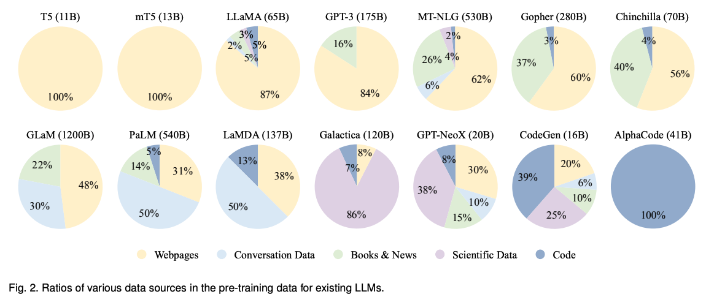

# A Survey of Large Language Models

- [A Survey of Large Language Models](#a-survey-of-large-language-models)
  - [1. INTRODUCTION](#1-introduction)
  - [2. OVERVIEW](#2-overview)
    - [2.1 LLMs的背景](#21-llms的背景)
      - [比例定律（Scaling Laws）](#比例定律scaling-laws)
      - [涌现能力（Emergent Abilities）](#涌现能力emergent-abilities)
      - [关键技术（Key Techniques）](#关键技术key-techniques)
    - [2.2 GPT系列模型的技术演进](#22-gpt系列模型的技术演进)
      - [早期探索](#早期探索)
      - [容量飞跃](#容量飞跃)
      - [能力提升](#能力提升)
      - [语言模型里程碑](#语言模型里程碑)
  - [3. LLM资源](#3-llm资源)
    - [3.1 公开可获取的模型或API](#31-公开可获取的模型或api)
      - [10B级别的模型](#10b级别的模型)
      - [100B级别的模型](#100b级别的模型)
      - [LLM的公开API](#llm的公开api)
    - [3.2 常用语料](#32-常用语料)
      - [Books](#books)
      - [CommonCrawl](#commoncrawl)
      - [Reddit Links](#reddit-links)
      - [Wikipedia](#wikipedia)
      - [Code](#code)
      - [其他](#其他)
    - [3.3 库资源](#33-库资源)
      - [Transformers](#transformers)
      - [DeepSpeed](#deepspeed)
      - [Megatron-LM](#megatron-lm)
      - [JAX](#jax)
      - [Colossal-AI](#colossal-ai)
      - [BMTrain](#bmtrain)
      - [FastMoE](#fastmoe)
  - [4. 预训练](#4-预训练)
    - [4.1 数据收集](#41-数据收集)
      - [4.1.1 数据源](#411-数据源)
      - [4.1.2 数据处理](#412-数据处理)
      - [4.1.3 预训练数据对LLM的影响](#413-预训练数据对llm的影响)
    - [4.2 架构](#42-架构)
      - [4.2.1 主流架构](#421-主流架构)
      - [4.2.2 详细配置](#422-详细配置)
      - [4.2.3 预训练任务](#423-预训练任务)
      - [4.2.4 总结和讨论](#424-总结和讨论)
    - [4.3 模型训练](#43-模型训练)
      - [4.3.1 优化设置](#431-优化设置)
      - [4.3.2 可扩展训练技术](#432-可扩展训练技术)
  - [5. 自适应调整](#5-自适应调整)
    - [5.1 指令调整](#51-指令调整)
      - [5.1.1 格式化实例构建](#511-格式化实例构建)
      - [5.1.2 指令调整策略](#512-指令调整策略)
      - [5.1.3 指令调整的影响](#513-指令调整的影响)
    - [5.2 对齐调整](#52-对齐调整)
      - [5.2.1 对齐的背景和标准](#521-对齐的背景和标准)
      - [5.2.2 收集人类反馈](#522-收集人类反馈)
      - [5.2.3 从人类反馈中强化学习](#523-从人类反馈中强化学习)
    - [5.3 高效调整（Efficient Tuning）](#53-高效调整efficient-tuning)
      - [5.3.1 参数高效微调方法](#531-参数高效微调方法)
        - [Adapter Tuning](#adapter-tuning)
        - [Prefix Tuning](#prefix-tuning)
        - [Prompt Tuning](#prompt-tuning)
        - [Low-Rank Adaptation（LoRA）](#low-rank-adaptationlora)
      - [5.3.2 LLM的参数高效微调](#532-llm的参数高效微调)
  - [6. 应用](#6-应用)
    - [6.1 情境学习（In-Context Learning）](#61-情境学习in-context-learning)
      - [6.1.1 提示词公式（Prompting Formulation）](#611-提示词公式prompting-formulation)
      - [6.1.2 示范设计（Demonstration Design）](#612-示范设计demonstration-design)
      - [6.1.3 底层机制](#613-底层机制)
    - [6.2 思维链（Chain-of-Thought）](#62-思维链chain-of-thought)
      - [6.2.1 使用CoT进行情境学习](#621-使用cot进行情境学习)
      - [6.2.2 CoT的更多讨论](#622-cot的更多讨论)
  - [7. 能力评估](#7-能力评估)
    - [7.1 基础评价任务](#71-基础评价任务)
      - [7.1.1 语言生成](#711-语言生成)
      - [7.1.2 知识运用](#712-知识运用)
      - [7.1.3 复杂推理](#713-复杂推理)
    - [7.2 进阶能力评估](#72-进阶能力评估)
      - [7.2.1 人类对齐](#721-人类对齐)
      - [7.2.2 与外界环境交互](#722-与外界环境交互)
      - [7.2.3 操作工具](#723-操作工具)
    - [7.3 公共基准与实证分析](#73-公共基准与实证分析)
      - [7.3.1 评估基准](#731-评估基准)
      - [7.3.2 LLM的综合能力分析](#732-llm的综合能力分析)
  - [8. 总结和展望](#8-总结和展望)
      - [理论与原则](#理论与原则)
      - [模型架构](#模型架构)
      - [模型训练](#模型训练)
      - [模型应用](#模型应用)
      - [安全性和对齐](#安全性和对齐)
      - [应用和生态系统](#应用和生态系统)

这篇综述发表于2023年4月28日，作者主要来自中国人民大学。

文章从四个方面来介绍LLM，包括pre-training，adaptation tuning，utilization 和 capacity evaluation。也总结了一些开发LLM的资源，并讨论未来值得研究的遗留问题。

文章官方git如下：[LLMSurvey](https://github.com/RUCAIBox/LLMSurvey)

## 1. INTRODUCTION

语言模型（LM）是提高机器智能的主要方法。可以分为四个发展阶段：

* Statistical language models (SLM)：统计语言模型。例如n-gram语言模型。SLM会有维度灾难问题。

* Neural language models (NLM)：神经语言模型。例如RNN、word2vec。word2vec通过浅层神经网络来学习分布式词表征。这些研究初步使用语言模型进行表征学习，对NLP领域发展有重要影响。

* Pre-trained language models (PLM)：预训练语言模型。例如ELMo，Bert。确定了pre-training和fine-tuning的范式。

* Large language models (LLM)：大语言模型。根据[scaling laws](https://arxiv.org/pdf/2001.08361.pdf)，扩大模型或增加数据可以提高下游任务的模型能力。虽然模型架构和预训练任务比较类似，但是大模型表现出惊人的能力（一般称为涌现现象，但是斯坦福有[论文](https://arxiv.org/pdf/2304.15004.pdf)提出涌现只是度量选择的结果）。

文章针对LLM所讲的四个方面具体如下：

* pre-training：预训练。

* adaptation-tuning：自适应调整。调整LLM的有效性和安全性。

* utilization：应用。如何利用LLM解决各种下游任务。

* capability evaluation：能力评估。如何通过现有实验评估LLM的能力。

## 2. OVERVIEW

### 2.1 LLMs的背景

#### 缩放定律（Scaling Laws）
LLM的架构和预训练目标与小模型类似，研究表明缩放可以很大程度上提高LLM的模型能力。因此建立定量方法来表征缩放的影响是很有用的。这里介绍两个对Transformer语言模型的代表性缩放定律：

* KM scaling law
这是2020年OpenAI的一篇论文，名字来源于两个一作的首字母。
他们首次提出针对三个主要因素对模型性能的幂律关系进行建模，即模型大小（N）、数据集大小（D）、训练计算量（C）。给定计算预算 c，他们凭经验提出了缩放定律的三个基本公式：

其中L(·)代表交叉熵损失。这三个定律是通过用不同数据大小（22M至23B个token）、模型大小（768M至1.5B非embedding参数）和训练计算量，在一些假设（例如，一个因素不能被另外两个因素限制）下拟合模型性能得到的。

* [Chinchilla scaling law](https://arxiv.org/pdf/2203.15556v1.pdf)  
参考：[知乎-Chinchilla](https://zhuanlan.zhihu.com/p/606038646)  
谷歌DeepMind团队做了范围更广的实验，模型大小从70M到16B，数据大小从5B到500B个token，得到了类似的公式：

这两篇的结论有所不同：给定10倍的计算预算，KM scaling law建议模型尺寸应该增加5.5倍，而训练的tokens数量应该增加1.8倍。相反，Chinchilla发现模型的尺寸和训练的tokens应该等比例的增加。

#### 涌现能力（Emergent Abilities）  
涌现能力一般定义为“小模型没有而在大模型中出现的能力”。简单介绍三种典型LLM的涌现能力以及代表模型。

* 情境学习（ICL）  
给语言模型一些自然语言指令和任务描述，在无需训练和梯度更新的情况下，它可以通过补全输入文本序列来得期望的输出。GPT-3展示出很强的ICL能力，而GPT-1和GPT-2没有。当然这个能力也和取决于具体下游任务。例如13B GPT-3已经在算数任务上有了ICL能力，而175B GPT-3深圳在波斯语QA任务上表现不好。
* 指令跟随  
通过instruction tuning，LLM可以在没见过的任务上表现良好。但是这种能力也只在模型大小达到一定量级才会出现。
* 逐步推理  
通过思维链（CoT）prompt策略，LLM可以通过涉及中间推理步骤的prompt机制解决数学推理问题，得出最终答案。这种能力据推测来源于训练数据中的代码。

#### 关键技术（Key Techniques）
* 缩放（Scaling）  
更大的模型、数据量和更多的训练计算量可以提升模型能力。一般计算经费是有限的，可以通过scaling law来更高效地分配计算资源。例如Chinchilla通过增加数据量、减小模型大小，在计算资源相同情况下，效果超过了Gopher。
* 训练（Training）  
分布式训练算法。业界发布了一些方便使用并行算法的框架，如DeepSpeed、Megatron-LM。
* 激发能力（Ability eliciting）  
经过大量语料的训练，LLM有了解决通用任务的潜在能力。在有些任务上这些能力并没有展示出来，需要通过设计指令或者特定的ICL策略来激发这些能力。例如CoT prompt可以通过包括中间过程来解决复杂推理问题。
* 对齐调整  
LLM可能产生有毒的、偏见的、有害的内容。有必要将LLM与人类价值观对齐，例如有用性、真实性、无害性。InstructGPT使用“基于人类反馈的强化学习（RLHF）”来解决这个问题。ChatGPT与之类似，展示了很强的对齐能力，可以产生高质量、无害回复。
* 操作工具  
LLM不擅长数字计算，而且限制于训练数据，不能获取最新信息。最新技术通过使用外部工具来解决这个问题。例如通过计算器来精确计算、通过使用搜索引擎来获取未知信息。LLM操作外部插件的应用也逐渐变多。

### 2.2 GPT系列模型的技术演进

#### 早期探索
* GPT-1。2017年谷歌推出Transformer，OpenAI基于这个新架构在2018发布了GPT-1。GPT-1是一个基于生成式的、decoder-only的Transformer架构，采用无监督预训练和有监督fine-tune的混合模式。GPT-1已经为GPT系列模型建立了核心架构，并建立了对自然语言文本建模的基本原理，即预测下一个词。
* GPT-2。基于类似于GPT-1的架构，GPT-2增加参数量到1.5B，使用网页数据WebText来训练。它可以在未经有标签数据fine-tune的情况下，通过无监督语言模型来完成一些任务。“由于（特定任务的）有监督目标与无监督（语言建模）目标相同，只是在序列的子集上进行评估，因此无监督目标的全局最小值也是有监督目标的全局最小值（适用于各种任务）。”这个主张的基本理解是，每个（自然语言处理）任务都可以被视为基于语料库的一个子集进行的词语预测问题。因此，如果无监督语言建模被训练得具备足够的能力来恢复语料库，它就有可能在解决各种任务上发挥作用。

#### 能力飞跃
虽然GPT-2有一定能力作为无监督多任务学习器，但是相比有监督sota还是差一些。基于GPT-2，GPT-3通过扩展生成式预训练架构实现关键的能力飞跃。

* GPT-3。2020年发布，模型参数175B。GPT-3论文正式介绍了情境学习（ICL），它通过few-shot或zero-shot的方式使用LLM。这样预训练和预测的任务得到了统一。GPT-3不仅在各种自然语言处理（NLP）任务中展现出非常出色的性能，还在一些特别设计的需要推理或领域适应能力的任务上表现出色。总体而言，GPT-3可以被视为从预训练语言模型（PLMs）发展到大型语言模型（LLMs）过程中的一个重要里程碑。它通过实证证明，将神经网络规模扩大到相当大的程度可以显著增加模型的能力。

#### 能力提升
OpenAI探索了两个进一步提升GPT-3能力的主要方法，在代码数据上训练和与人类对齐

* 在代码数据上训练
GPT-3的主要缺陷是在复杂任务上缺乏推理能力，例如补全代码和解决数学问题。2021年7月，OpenAI提出了Codex，一个利用GitHub代码训练的GPT模型。2022年1月，提出了一个训练文本和代码embedding的对比学习方法。GPT-3.5基于code-based GPT模型（code-davinci-002）发展而来，这说明在代码数据上训练是提升模型能力的很好的方法。并且基于代码数据训练可以提升LLM的CoT能力。
* 与人类对齐  
2017年OpenAI发布了名为“learning from humanpreferences”的博客，利用强化学习从人类标注的偏好比较中学习。2017年7月，Proximal Policy Optimization（PPO，近端策略优化）算法发布，目前它已经是从人类偏好中学习的基础RL算法。2020年1月，利用上述RL算法对GPT-2微调，利用人类偏好提升其在NLP任务上的能力。2022年1月，提出InstructGPT，正式建立了三阶段的RLHF算法。

#### 语言模型里程碑
* ChatGPT。2022年11月，OpenAI发布ChatGPT。它与InstructGPT训练方法类似，特别在对话方面做了优化。ChatGPT的推出对未来人工智能研究产生了重大影响，为探索类人人工智能系统提供了思路
* GPT-4。扩展为多模态输入。GPT-4对恶意或挑衅性查询的回应更加安全，这是因为它经过了为期六个月的迭代调整（在RLHF训练中还加入了额外的安全奖励信号）。另外，GPT-4是基于一个成熟的深度学习基础架构开发的，并采用了改进的优化方法。他们引入了一种名为"可预测的缩放"的新机制，在模型训练过程中可以用较少的计算量准确预测最终的性能。  
尽管取得了巨大进步，但是LLM仍然存在问题，例如GPT-4生成的内容可能存在虚假错误或潜在风险的回应。

## 3. LLM资源

### 3.1 公开可获取的模型或API

#### 10B级别的模型
这部分介绍的大部分参数都在10B到20B之间，除了LLaMA（最大版本65B参数）和NLLB（最大版本54.5B参数）。这个范围的其他模型包括**mT5、PanGu-\alpha、T0、GPT-NeoX-20B、CodeGen、UL2、Flan-T5和mT0**。其中，Flan-T5（11B版本）可以作为研究instruction tuning的首选模型，因为它从多个方面探索了instruction tuning：增加任务数量、扩展模型大小、使用思维链提示数据做fine-tune。除此之外，CodeGen（11B版本），作为一个设计用来生成代码的自回归语言模型，可以作为探索代码生成能力的很好的候选。它还引入了一个新的基准 MTPB，专门用于多轮代码合成，由 115 个专家生成的问题组成。为了解决这些问题，需要LLM获取足够的编程知识（如，数学、array操作和算法）。至于多语言任务，mT0（13B版本）可以作为一个很好的候选模型，它使用多语言任务和多语言prompt做了fine-tine。此外，PanGu-\alpha在中文下游任务的zero-shot和few-shot设定下表现良好，它基于深度学习框架MindSpore开发。注意PanGu-\alpha有多个版本，最高200B参数，开源的最多有13B参数。作为更新的版本，LLaMA（65B版本），大概有5位于其他模型的参数量，已经在指令跟随方面的任务展现出更好的效果。  
通常，在这个量级预训练模型成百上千的GPU或TPU。例如，GPT-NeoX-20B用了12个超微服务器，每个配备了8个NVIDIA A100-SXM4-40GB GPU，而LLaMA使用了2048个A100-80G GPU。为了更精确估计所需的计算资源，建议使用衡量所涉及计算数量的指标，例如FLOPS（即每秒浮点数操作）。

#### 100B级别的模型
这个类别的模型只有少数开源。例如，OPT、OPT-IML、BLOOM、BLOOMZ与GPT-3（175B版本）参数量差不多，而GLM和Galactica分别有130B和120B参数。其中，OPT（175B版本）专门用于开放共享，旨在使研究人员能够大规模开展可重复的研究。BLOOM（176B版本）和BLOOMZ（176B版本）得益于其在多语言建模任务的能力，可以作为跨语言生成研究的基础模型。在这些模型中，OPT-IML用指令调整过，可以作为研究指令调整的很好候选。这个级别的模型通常需要上千GPU或TPU来训练。例如，OPT（175B版本）用了992个A100-80GB GPU，而GLM（130B版本）用了96个节点的NVIDIA DGX-A100（8*40G）GPU集群。

#### LLM的公开API
OpenAI提供了7个GPT-3系列的模型：ada、babbage、curie、davinci、text-data-001、text-babbage-001和text-curie-001。其中前四个接口可以在OpenAI的主机服务器上继续fine-tune。特别的，babbage、curie和davinci分别对应GPT-3（1B）、GPT-3（6.7B）和GPT-3（175B）模型。此外，还有两个关于Codex的API，叫code-cushman-001（一个强大的多语言版本Codex（12B））和code-davinci-002。此外，GPT-3.5系列包括一个基础模型code-davinci-002和三个增强版本，叫做text-davinci-002、text-davinci-003和gpt-3.5-turbo-0301。最近，OpenAI又发布了GPT-4对应的API，包括gpt-4、 gpt-4-0314、 gpt-4-32k和gpt-4-32k-0314。

### 3.2 常用语料

#### Books
BookCorpus，包含11,000本书，涵盖广泛的主题和类型（如，小说和自传）。
Gutenbert项目，由 70,000 多本文学书籍组成，包括小说、散文、诗歌、戏剧、历史、科学、哲学和其他类型的公共领域作品。GPT-3所使用的Books1和Books2，比BookCorpus大很多，但是没有公开发布。

#### CommonCrawl
CommonCrawl是从网络抓取的数据集。有四个常用的语料：C4、CC-Stories、CC-News和RealNews。Colossal Clean Crawled Corpus（C4）包括5个变体，分别是en（806G）、en.noclean（6T）、realnewslike（36G）、webtextlike（17G）和multilingual（38T）。en版本用来预训练T5、LaMDA、Gopher和UL2。多语言C4，也叫MC4，被用来训练mT5。CC-Stories（33G）是CommonCrawl数据的一个子集，它的内容用类似故事的方式制作。原始版本的CC-Stories无法使用，所以table 2介绍了CC-Stories-R。另外，两个从CommonCrawl摘取的新闻数据集RealNews（120G）和CC-News（76G）也经常被用来预训练。

#### Reddit Links
WebText是一个由高赞Reddit链接数据构成的著名数据集，但是没有公开。作为替代，有一个可以获取到开源版本叫OpenWebText。另一个从Reddit摘取的数据集叫PushShift.io，一个实时更新的数据集，由 Reddit 自创建之日起的历史数据组成。

#### Wikipedia
Wikipedia是一个在线的百科全书，包含各个主题的大量高质量文章。这些文章中的大多数都是以说明文的写作风格（带有支持性参考文献）撰写的，涵盖了广泛的语言和领域。 通常，仅英语过滤版本的维基百科被广泛用于大多数 LLM（例如，GPT-3、LaMDA 和 LLaMA）。 维基百科有多种语言版本，因此可以在多语言环境中使用。

#### Code
两个主要来源是开源代码仓库（GitHub）和代码相关的问答平台（StackOverflow）。谷歌公开发布了BigQuery数据库，包括各种语言的大量开源代码片段，作为代表性代码数据集。CodeGen使用了BIGQUERY，一个BigQuery的子集，来训练多语言版本的CodeGen（CodeGen-Multi）。

#### 其他
Pile是一个大规模、多样化和开源的文本数据集，包含来自多个来源的超过 800GB 的数据，包括书籍、网站、代码、科学论文和社交媒体平台。此外，ROOTS由各种较小的数据集（总共 1.61 TB 的文本）组成，涵盖 59 种不同的语言（包括自然语言和编程语言），被用来训练BLOOM。

介绍3个有代表性的LLM所使用的预训练数据集：

* GPT-3（175B）在300B个token的混合数据上训练，包括CommonCrawl、WebText2、Books1、Books2和Wikipedia。
* PaLM（540B）使用780B个token的预训练数据，包括社交媒体对话、过滤的网页、书、Github、多语言Wikipedia和新闻。
* LLaMA从各种来源提取训练集，包括CommonCrawl、C4、GitHub、Wikipedia、books、ArXiv和StackExchange。LLaMA（6B）和LLaMA（13B）的训练数据量为1.0T个token，LLaMA（32B）和LLaMA（65B）使用1.4T个token。

### 3.3 库资源

#### Transformers
Hugging Face的python包。

#### DeepSpeed
微软的深度学习优化库（适配PyTorch），用来训练很多LLM，例如MT-NLG和BLOOM。它提供了分布式训练的多种优化技术，例如内存优化（ZeRO技术，梯度检查点（gradient checkpointing））和pipeline并行。

#### Megatron-LM
NVIDIA的深度学习库，用了训练大规模语言模型。也提供了分布式训练的优化技术，包括模型和数据并行，混合精度训练，还有FlashAttention。可以大大提高训练效率和速度。

#### JAX
谷歌的高性能机器学习算法库，允许用户使用硬件加速轻松地对数组执行计算。

#### Colossal-AI
HPC-AI Tech的用来进行大规模AI模型训练的深度学习库。基于PyTorch实现，支持丰富的并行训练策略集合。

#### BMTrain
OpenBMB开发的高效模型训练库。

#### FastMoE
是一个专门用于 MoE（即专家混合）模型的训练库。

## 4. 预训练

### 4.1 数据收集

#### 4.1.1 数据源

数据源可以分为两类：通用数据和专用数据。

* 通用数据
	* 网页
	* 对话文本
	* 书
* 专用数据
	* 多语言文本
	* 科学文本。例如arXiv论文、科学教科书、数学网页。通常需要将公式等转换为语言模型可处理的格式。
	* 代码

#### 4.1.2 数据处理

* 质量过滤。删除低质量数据现有方法主要有两种：基于分类和基于启发式。前一种方法基于高质量文本训练选择分类器，并利用它来识别和过滤掉低质量数据。但是分类方法可能错误去掉高质量数据，导致偏差和多样性减少
* 去重
* 隐私编辑
* 分词

#### 4.1.3 预训练数据对LLM的影响

### 4.2 架构

#### 4.2.1 主流架构

#### 4.2.2 详细配置

#### 4.2.3 预训练任务

#### 4.2.4 总结和讨论

### 4.3 模型训练

#### 4.3.1 优化设置

#### 4.3.2 可扩展训练技术

## 5. 自适应调整

### 5.1 指令调整

#### 5.1.1 格式化实例构建

#### 5.1.2 指令调整策略

#### 5.1.3 指令调整的影响

### 5.2 对齐调整

#### 5.2.1 对齐的背景和标准

#### 5.2.2 收集人类反馈

#### 5.2.3 从人类反馈中强化学习

### 5.3 高效调整（Efficient Tuning）

#### 5.3.1 参数高效微调方法

##### Adapter Tuning

##### Prefix Tuning

##### Prompt Tuning

##### Low-Rank Adaptation（LoRA）

#### 5.3.2 LLM的参数高效微调

## 6. 应用

### 6.1 情境学习（In-Context Learning）

#### 6.1.1 提示词公式（Prompting Formulation）

#### 6.1.2 示范设计（Demonstration Design）

#### 6.1.3 底层机制

### 6.2 思维链（Chain-of-Thought）

#### 6.2.1 使用CoT进行情境学习

#### 6.2.2 CoT的更多讨论

## 7. 能力评估

### 7.1 基础评价任务

#### 7.1.1 语言生成

#### 7.1.2 知识运用

#### 7.1.3 复杂推理

### 7.2 进阶能力评估

#### 7.2.1 人类对齐

#### 7.2.2 与外界环境交互

#### 7.2.3 操作工具

### 7.3 公共基准与实证分析

#### 7.3.1 评估基准

#### 7.3.2 LLM的综合能力分析

## 8. 总结和展望

#### 理论与原则

#### 模型架构

#### 模型训练

#### 模型应用

#### 安全性和对齐

#### 应用和生态系统

