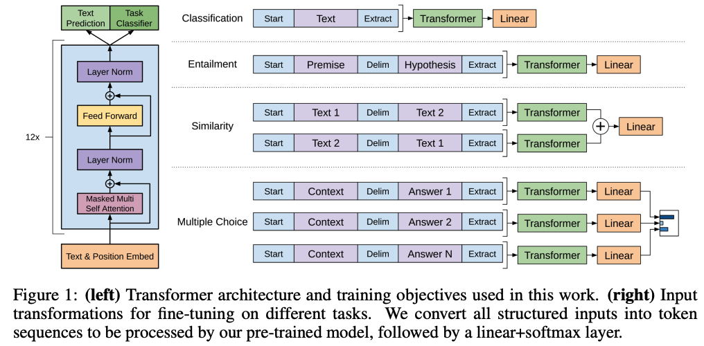
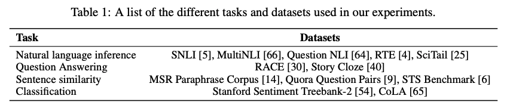
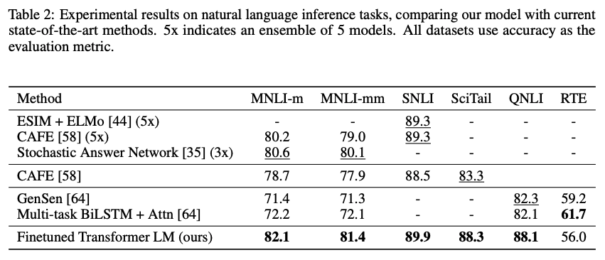
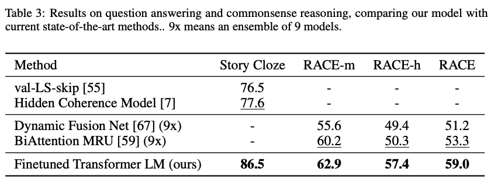
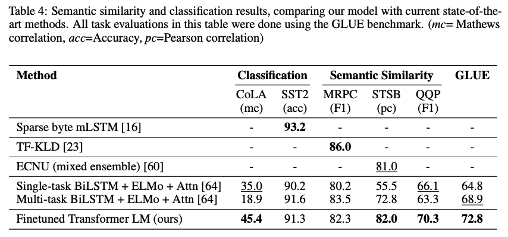
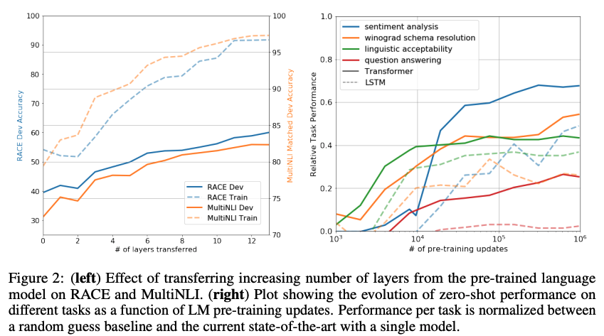
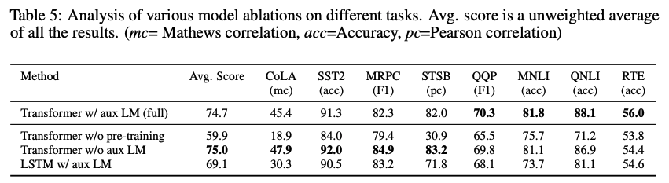

# Improving Language Understanding by Generative Pre-Training

这篇论文是OpenAI在2018年发布的，介绍初版GPT模型。虽然当时带火预训练+微调的是bert模型，但GPT比bert发布时间要早一些。
## 摘要
自然语言理解涵盖了广泛的多样任务，如文本蕴含、问答、语义相似度评估和文档分类。虽然大量无标签的文本语料库充足，但用于学习这些特定任务的标记数据却很少，这使得判别式训练模型难以表现出足够的性能。我们证明，通过对多样无标签文本语料进行生成式预训练，然后在每个特定任务上进行判别式微调，可以实现在这些任务上的显著增益。与以往方法不同的是，我们在微调过程中利用了任务感知的输入转换，以在要求对模型架构进行最小改动的同时实现有效的迁移。我们在自然语言理解的多个基准测试中展示了我们方法的有效性。我们的通用任务无关模型在9个研究中的12个任务中超过了专门为每个任务设计的判别式训练模型，在常识推理（Stories Cloze Test）中实现了8.9%的绝对改进，在问答（RACE）中实现了5.7%的改进，在文本蕴含（MultiNLI）中实现了1.5%的改进。
## 1. 简介
从原始文本中有效地学习是减轻自然语言处理（NLP）中对监督学习依赖的关键。大多数深度学习方法需要大量手动标注的数据，这限制了它们在许多领域的适用性，因为这些领域缺乏注释资源。在这些情况下，能够利用未标记数据中的语言信息的模型为收集更多注释提供了有价值的替代方案，而收集注释可能是耗时且昂贵的。此外，即使在有大量监督的情况下，以无监督的方式学习良好的表示也可以显著提高性能。迄今为止，最有说服力的证据是广泛使用预训练的词嵌入来改善各种NLP任务的性能。

然而，从未标记的文本中利用除了单词级别信息以外的信息具有挑战性，主要有两个原因。首先，目前尚不清楚哪种优化目标在学习对迁移任务有用的文本表示方面最有效。最近的研究探索了各种目标，如语言建模、机器翻译和语篇连贯性，每种方法在不同的任务上表现出色。其次，在将这些学习到的表示转移到目标任务时，没有就最有效的方法达成共识。现有的技术涉及对模型架构进行任务特定的修改、使用复杂的学习方案和添加辅助学习目标的组合。这些不确定性使得开发有效的半监督学习方法用于语言处理变得困难。

在本文中，我们探索了一种半监督的语言理解任务方法，该方法结合了无监督的预训练和有监督的微调。我们的目标是学习一个通用表示，可以在各种任务中进行少量的适应即可进行迁移。我们假设可以访问一个大规模的未标记文本语料库和一些具有人工注释训练样本（目标任务）的数据集。我们的设置不要求这些目标任务与未标记的语料库处于相同的领域。我们采用了一个两阶段的训练过程。首先，我们使用语言建模目标在未标记的数据上学习神经网络模型的初始参数。随后，我们使用相应的有监督目标将这些参数调整到目标任务上。

在我们的模型架构中，我们使用了Transformer，它已经在各种任务上表现出色，例如机器翻译 、文档生成和句法分析。与循环网络等替代方法相比，这种模型选择为我们提供了更结构化的记忆，以处理文本中的长期依赖关系，从而在各种任务之间实现了强大的迁移性能。在迁移过程中，我们利用基于遍历风格的方法得出的任务特定的输入适应，这些方法将结构化的文本输入处理为一个连续的标记序列。正如我们在实验中所证明的，这些适应方法使我们能够在对预训练模型的架构进行最小改动的情况下进行有效的微调。

我们在四种类型的语言理解任务上评估了我们的方法——自然语言推断、问答、语义相似度和文本分类。我们的通用任务无关模型胜过那些针对每个任务专门设计的差异化训练模型，在研究的12个任务中的9个任务中显著改善了现有技术水平。例如，在常识推理（Stories Cloze Test）上，我们实现了8.9%的绝对改进，在问答（RACE）上实现了5.7%的绝对改进，在文本蕴含（MultiNLI）上实现了1.5%的绝对改进，以及在最近推出的GLUE多任务基准上实现了5.5%的绝对改进。我们还分析了预训练模型在四种不同设置下的零样本行为，并展示它对下游任务获得了有用的语言知识。

## 2. 相关工作
#### 自然语言处理中的半监督学习
我们的工作主要属于自然语言处理领域的半监督学习范畴。这种范式引起了广泛的兴趣，并应用于诸如序列标注或文本分类等任务中。最早的方法利用无标签数据计算词级或短语级的统计信息，然后将其作为监督模型的特征。在过去几年中，研究人员已经证明了使用在无标签语料库上训练的词嵌入来提高各种任务的性能的好处。然而，这些方法主要是传递词级信息，而我们的目标是捕捉更高层次的语义信息。

最近的方法研究了从无标签数据中学习和利用超过词级语义的信息。可以使用无标签语料库进行训练的短语级或句子级嵌入已被用于将文本编码为适合各种目标任务的向量表示。

#### 无监督预训练
无监督预训练是半监督学习的一种特殊情况，其目标是找到一个良好的初始化点，而不是修改监督学习的目标。早期的研究探索了在图像分类和回归任务中使用这种技术的方法。随后的研究证明了预训练作为一种正则化方案，可以在深度神经网络中实现更好的泛化性能。在最近的研究中，该方法已被用于帮助在各种任务上训练深度神经网络，如图像分类、语音识别、实体消歧和机器翻译等。

与我们的工作最相关的工作线是使用语言建模目标对神经网络进行预训练，然后在有监督的目标任务上进行微调。Dai等人和Howard和Ruder采用了这种方法来改善文本分类。然而，尽管预训练阶段有助于捕捉一些语言信息，但他们使用LSTM模型限制了其预测能力的范围。相反，我们选择Transformer网络使我们能够捕捉更长距离的语言结构，这在我们的实验中得到了证明。此外，我们还展示了我们的模型在更广泛的任务上的有效性，包括自然语言推理、近义词检测和故事完成等。其他方法在目标任务上训练监督模型时，使用来自预训练语言模型或机器翻译模型的隐藏表示作为辅助特征。这涉及到为每个单独的目标任务引入大量的新参数，而我们在迁移时只需要对模型架构进行最小的更改。

#### 辅助训练目标
添加辅助的无监督训练目标是半监督学习的另一种形式。Collobert和Weston的早期工作使用了各种辅助的自然语言处理任务，如词性标注、块分块、命名实体识别和语言建模，以改善语义角色标注的性能。最近，Rei在目标任务目标上添加了辅助的语言建模目标，并在序列标注任务上展示了性能提升。我们的实验也使用了一个辅助目标，但正如我们所展示的，无监督预训练已经学习到了与目标任务相关的几个语言方面。

## 3. 框架
我们的训练过程分为两个阶段。第一阶段是在大规模文本语料库上学习一个高容量的语言模型。然后，我们进行微调阶段，使用带有标记数据的判别性任务来调整模型。
### 3.1 无监督预训练
给定一个无监督的标记语料库$U = \{u_1, ..., u_n\}$，我们使用标准的语言建模目标最大化以下似然函数：
$$\tag{} $$
$$L1(U)=\sum_{i} \log P(u_{i}|u_{i−k},...,u_{i−1}; \theta) \tag{1}$$
其中，$k$表示上下文窗口的长度，条件概率$P$通过具有参数$\theta$的神经网络进行建模。这些参数使用随机梯度下降进行训练。
在我们的实验中，我们使用了一个多层的Transformer解码器（decoder）作为语言模型，它是Transformer的一种变体。该模型对输入上下文标记应用了多头自注意操作，然后经过逐位置的前馈层，生成了目标标记上的输出分布。
$$h_0=UW_e+W_p$$
$$h_l=\text{transformer\_block}(h_{l-1} \forall i \in [1, n]) \tag{2}$$
$$P(u)=\text{softmax}(h_nW_e^T)$$
其中$U=(u_{-k}, ..., u_{-1})$是token的上下文向量，$n$是层数，$W_e$是token embedding矩阵，$W_p$是position embedding矩阵。

### 3.2 有监督微调
在使用公式$(1)$中的目标进行模型训练后，我们将参数调整到有监督的目标任务上。我们假设有一个带有标签的数据集$C$，其中每个实例由一系列输入标记$x_1，...，x_m$和一个标签$y$组成。输入通过我们预训练的模型，得到最终Transformer块的激活$h_l^m$，然后将其输入到添加的线性输出层，该层具有参数$W_y$，用于预测$y$：
$$P(y|x^1,...,x^m)=\text{softmax} (h_l^m W_y) \tag{3}$$
这为我们提供了以下最大化目标：
$$L_2(C)=\sum_{(x,y)}logP(y|x^1,...,x^m) \tag{4}$$
我们还发现，将语言建模作为微调的辅助目标有助于学习，它通过两个方面改善了结果：(a) 提高了监督模型的泛化能力，(b) 加快了收敛速度。这与之前的研究一致，他们也观察到了使用这样的辅助目标可以改善性能。具体来说，我们优化了以下带有权重$\lambda$的目标函数：
$$L_3(C)=L_2(C)+\lambda * L_1(C)$$
总体而言，在微调过程中，我们只需要额外的参数$W_y$和用于分隔符token的embedding（在第3.3节中描述）。

### 3.3 任务特定的输入转换
对于一些任务，例如文本分类，我们可以按照上述描述直接对模型进行微调。但是，某些其他任务，如问答或文本蕴涵，具有结构化的输入，例如有序的句子对或文档、问题和答案的三元组。由于我们的预训练模型是在连续文本序列上进行训练的，因此我们需要对其进行一些修改才能应用于这些任务。以前的工作提出了在传递的表示之上学习特定任务的体系结构。这种方法重新引入了大量的任务特定定制，并且对于这些额外的体系结构组件不使用迁移学习。相反，我们采用了一种遍历式的方法，将结构化输入转换为我们的预训练模型可以处理的有序序列。这些输入转换使我们能够避免在任务之间进行广泛的体系结构更改。以下是对这些输入转换的简要描述，图1提供了可视化示例。所有转换都包括添加随机初始化的起始和结束令牌（$\lt s \gt，\lt e \gt$）。

* 蕴含任务。对于蕴含任务，我们将前提p和假设h的token序列进行连接，其中在它们之间加入了一个分隔符令牌($)。
* 相似度。对于相似度任务，比较的两个句子之间没有固有的顺序。为了反映这一点，我们修改输入序列，包含两种可能的句子顺序（之间有一个分隔符），并独立地处理每个序列，以产生两个序列表示$h_l^m$。然后，将它们在元素级别进行相加，并将结果输入线性输出层进行处理。
* 问答和常识推理。对于这些任务，我们会给定一个上下文文档$z$、一个问题$q$，以及一组可能的答案$\{a_k\}$。我们将文档上下文和问题与每个可能的答案连接起来，中间添加一个分隔符令牌，得到$[z; q; \$; a_k]$。每个序列都会独立地通过我们的模型进行处理，然后通过softmax层进行归一化，以产生可能答案的输出分布。

## 4. 实验
### 4.1 配置
* 无监督预训练。我们使用了BooksCorpus数据集来训练语言模型。该数据集包含了超过7,000本独特的未发布图书，涵盖了各种流派，包括冒险、奇幻和浪漫。关键是，它包含了大段连续的文本，使生成模型能够学习对长距离信息进行条件约束。另一个数据集是1B Word Benchmark，与类似方法ELMo使用的数据集大小相近，但在句子级别上进行了混洗，破坏了长距离结构。我们的语言模型在这个语料库上实现了非常低的标记级困惑度，为18.4。

* 模型规格。我们的模型在很大程度上遵循了最初的Transformer工作。我们训练了一个12层的decoder-only的Transformer，使用了掩码自注意力头（768维状态和12个注意力头）。对于位置逐元素前馈网络，我们使用了3072维的内部状态。我们使用Adam优化方案，最大学习率为2.5e-4。学习率在前2000次更新中线性增加，然后使用余弦调度退火到0。我们使用64个随机抽样的连续序列，每个序列包含512个标记，进行100个周期的训练。由于模型中广泛使用了层归一化，使用N(0, 0.02)的简单权重初始化已经足够。我们使用了一个包含40,000个合并操作的**字节对编码（BPE）**词汇表，并使用0.1的学习率进行残差、嵌入和注意力的丢弃以进行正则化。我们还采用了L2正则化的修改版本，在所有非偏置或增益权重上使用w = 0.01。激活函数我们使用了**高斯误差线性单元（GELU）**。我们使用了学习的位置嵌入，而不是原始工作中提出的正弦版本。我们使用ftfy库2清理BooksCorpus中的原始文本，标准化一些标点符号和空白，并使用spaCy分词器3。
* 微调细节。除非另有说明，我们重新使用了无监督预训练的超参数设置。我们对分类器添加了dropout层，丢弃率为0.1。对于大多数任务，我们使用学习率为6.25e-5，batch大小为32。我们的模型微调速度快，大多数情况下进行3个周期的训练就足够了。我们使用线性学习率衰减计划，并在训练的0.2%部分进行预热。$\lambda$被设置为0.5。

### 4.2 有监督微调
我们对各种监督任务进行了实验，包括自然语言推断、问答、语义相似度和文本分类。其中一些任务是作为最近发布的GLUE多任务基准测试的一部分，我们使用了这些任务。图1提供了所有任务和数据集的概述。
* 自然语言推断。自然语言推断（NLI）任务，也称为文本蕴涵识别，涉及阅读一对句子并判断它们之间的关系，可以是蕴涵、矛盾或中性。尽管近年来引起了很大的关注，但由于存在诸如词汇蕴涵、共指和词汇和句法歧义等各种现象，该任务仍然具有挑战性。我们在五个具有不同来源的数据集上进行评估，包括图像标题（SNLI）、转录语音、流行小说和政府报告（MNLI）、维基百科文章（QNLI）、科学考试（SciTail）或新闻文章（RTE）。
* 表2详细列出了我们的模型和先前最先进方法在不同NLI任务上的各种结果。我们的方法在五个数据集中的四个上明显优于基准线，在MNLI上提高了高达1.5%，在SciTail上提高了5%，在QNLI上提高了5.8%，在SNLI上提高了0.6%。这表明我们的模型能够更好地推理多个句子，并处理语言的歧义方面。在我们评估的较小数据集RTE上（2490个示例），我们的准确率为56%，低于多任务双向LSTM模型报告的61.7%。鉴于我们的方法在较大的NLI数据集上的出色表现，我们的模型很可能也会从多任务训练中受益，但目前我们尚未探索这个方向。

* 问答和常识推理。另一个需要单句和多句推理的任务是问答。我们使用最近发布的RACE数据集，该数据集包含了中学和高中考试中的英语段落和相关问题。这个语料库已经被证明包含了比CNN 或SQuaD等其他数据集更多的推理类型问题，为我们的模型提供了完美的评估，因为我们的模型经过训练可以处理长距离的上下文。此外，我们还在Story Cloze Test上进行了评估，该任务涉及从两个选项中选择正确的多句故事结尾。在这些任务中，我们的模型再次显著优于先前的最佳结果，Story Cloze上提高了高达8.9%，整体上在RACE上提高了5.7%。这证明了我们的模型有效处理长距离上下文的能力。

* 语义相似度。语义相似度（或释义检测）任务涉及预测两个句子是否在语义上等效。挑战在于识别概念的改写、理解否定以及处理句法歧义。我们在这个任务中使用了三个数据集 - Microsoft Paraphrase语料库（MRPC）（从新闻来源收集），Quora问题对（QQP）数据集和语义文本相似性基准测试（STS-B）。我们在三个语义相似度任务中的两个上取得了最先进的结果（表4），在STS-B上绝对提高了1个点。在QQP上的性能提升显著，相对于单任务BiLSTM + ELMo + Attn，绝对提高了4.2%。
* 分类。最后，我们还在两个不同的文本分类任务上进行了评估。语言可接受性语料库（CoLA）包含了专家对句子是否语法正确的判断，并测试了训练模型的固有语言偏见。另一方面，斯坦福情感树库（SST-2）是一个标准的二元分类任务。我们的模型在CoLA上获得了45.4的分数，这是比先前最佳结果35.0大幅提升，展示了我们的模型学到的固有语言偏见。模型在SST-2上也实现了91.3%的准确率，与最先进的结果相当。我们还在GLUE基准测试中获得了72.8的总体分数，明显优于先前的最佳结果68.9。

总体而言，我们的方法在我们评估的12个数据集中的9个数据集中取得了新的最先进结果，在许多情况下超过了集成模型的性能。我们的结果还表明，我们的方法在不同规模的数据集上都表现良好，从较小的数据集（如STS-B，约5.7k个训练样本）到最大的数据集SNLI（约550k个训练样本）都适用。

## 5. 分析
* 层次迁移数量的影响。我们观察了从无监督预训练中迁移不同数量层次到监督目标任务的影响。图2（左）展示了我们方法在MultiNLI和RACE上的性能随迁移层数变化的情况。我们观察到传递嵌入的标准结果改善了性能，并且每个transformer层次在MultiNLI上提供了多达9%的进一步收益。这表明预训练模型中的每个层次都包含了解决目标任务的有用功能。

* 零样本任务行为。

我们希望更好地理解为什么对于transformer模型来说，语言模型的预训练是有效的。一种假设是基础生成模型通过学习执行我们评估的许多任务来提高其语言建模能力，而transformer的更结构化的注意力内存相对于LSTM有助于迁移。我们设计了一系列启发式解决方案，利用基础生成模型在没有监督微调的情况下执行任务。我们在图2（右）中可视化了这些启发式解决方案在生成预训练过程中的有效性。我们观察到这些启发式解决方案的性能稳定，并且随着训练的进行而稳步增加，这表明生成预训练支持学习多种任务相关功能。我们还观察到LSTM的零样本性能具有更高的方差，这表明Transformer架构的归纳偏差有助于迁移。

对于CoLA（语言可接受性）任务，我们将示例的得分定义为生成模型分配的平均标记对数概率，并通过阈值来进行预测。对于SST-2（情感分析）任务，我们在每个示例中添加词汇"very"，并将语言模型的输出分布限制为仅包含"positive"和"negative"两个词，并猜测分配更高概率的词作为预测结果。对于RACE（问答）任务，我们选择生成模型在给定文档和问题条件下分配的平均标记对数概率最高的答案作为预测答案。对于DPRD（Winograd模式）任务，我们将确定代词替换为两个可能的指代对象，并预测在替换后其余序列上生成模型分配更高的平均标记对数概率的解析结果。

* 消融研究。

我们进行了三项不同的消融研究（表5）。首先，我们研究了在微调过程中没有辅助语言模型目标时的方法性能。我们观察到辅助目标在NLI任务和QQP上有所帮助。总体趋势表明，较大的数据集受益于辅助目标，但较小的数据集则没有。其次，我们通过将Transformer与使用相同框架的单层2048单元LSTM进行比较，分析了Transformer的影响。我们观察到，使用LSTM而不是Transformer时，平均得分下降了5.6个单位。只有在MRPC数据集上，LSTM的表现优于Transformer。最后，我们还将其与直接在有监督目标任务上进行训练的Transformer架构进行了比较，而没有进行预训练。我们观察到缺乏预训练对所有任务的性能有所损害，相比于我们的完整模型，性能下降了14.8%。

## 6. 结论
我们提出了一个框架，通过生成式预训练和判别式微调，实现了强大的自然语言理解能力的单一通用模型。通过在包含长串连续文本的多样化语料库上进行预训练，我们的模型获得了显著的世界知识和处理长程依赖的能力，然后成功地将这些能力转移到解决诸如问答、语义相似性评估、蕴含判断和文本分类等判别性任务上，在我们研究的12个数据集中，其中9个数据集的性能超过了当前的最优结果。利用无监督（预）训练提高判别性任务的性能长期以来一直是机器学习研究的重要目标。我们的工作表明，确实可以实现显著的性能提升，并提供了哪些模型（Transformers）和数据集（具有长程依赖的文本）最适合这种方法的线索。我们希望这将有助于促进对无监督学习的新研究，无论是在自然语言理解还是其他领域，进一步改善我们对无监督学习的工作原理和应用时机的理解。