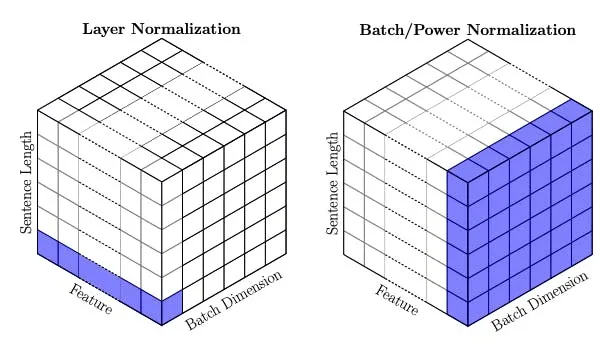

## Transformer Notes
#### Transformer简介
* 以机器翻译为例：Transformer的输入是一种语言的句子，输出是另一种语言的句子
* 更详细来讲，输入是token embedding和position embedding相加的矩阵；输出是长度为词表大小的向量，表示下一个词的概率
* Transformer由Encoder模块和Decoder模块组成
* Encoder由多层堆叠的self-attention和FFN子模块组成，每个子模块后面都加上残差连接和LayerNorm
* Decoder与Encoder类似，不同在于多了一个encoder-decoder交互的cross attention，并且decoder的self-attention增加了掩码，目的是为了让模型当前位置的输出只依赖于之前的信息。

#### Attention步骤
* 将每个token的embedding转化为Q、K、V向量。方法是用embedding分别乘以三个可训练的矩阵
* 通过Q向量和K向量点乘计算一个score。比如有10个token，将第一个token的Q与其他每个token的K点乘
* 然后将这些score除以根号d_k，再做一个softmax
* 将这些score分别乘以每个token的V向量，再求和。作用就是保持想要关注的词的重要性，忽略不相关的词（乘以0.0001的权重）。
* 至此第一个词的attention输出计算完毕
* 实际操作时整个过程是用矩阵的方式去做，$Attention(Q, K, V)=Softmax(\frac{QK^T}{\sqrt{d_k}})V$，其中Q、K、V、输出都是$seq\_len*d_k$维度
* Attention代码

```python
def attention(query, key, value, mask=None):
	d_k = query.size(-1)
	scores = torch.matmul(query, key.transpose(-2, -1) / math.sqrt(d_k))
	if mask is not None:
		scores = scores.mask_fill(mask==0, -1e9)
	weight = scores.softmax(dim=-1)
	return torch.matmul(weight, value)
```
#### Layer Normalization vs. Batch Normalization


```
class LayerNorm(nn.Module):
    "Construct a layernorm module (See citation for details)."

    def __init__(self, features, eps=1e-6):
        super(LayerNorm, self).__init__()
        self.a_2 = nn.Parameter(torch.ones(features))
        self.b_2 = nn.Parameter(torch.zeros(features))
        self.eps = eps

    def forward(self, x):
        mean = x.mean(-1, keepdim=True)
        std = x.std(-1, keepdim=True)
        return self.a_2 * (x - mean) / (std + self.eps) + self.b_2
        
class RMSNorm(nn.Module):
    def __init__(self, d, eps=1e-8):
        """
        Root Mean Square Layer Normalization
        :param d: model size
        :param eps:  epsilon value, default 1e-8
        """
        super(RMSNorm, self).__init__()

        self.eps = eps
        self.d = d

        self.scale = nn.Parameter(torch.ones(d))

    def forward(self, x):
        norm_x = x.norm(2, dim=-1, keepdim=True)
        d_x = self.d

        rms_x = norm_x * d_x ** (-1. / 2)
        x_normed = x / (rms_x + self.eps)

        return self.scale * x_normed
```
* Batch Norm在batch维度和seq\_len维度做归一化，Layer Norm在feature维度做归一化。
* Batch Norm
	* 优点
		* 允许较大的学习率
		* 减弱对初始化的强依赖性
		* 保持隐藏层中数值的均值、方差不变，让数值更稳定，为后面网络提供坚实的基础
		* 有轻微的正则化作用（相当于给隐藏层加入噪声，类似Dropout）
	* 缺点
		* 每次是在一个batch上计算均值、方差，如果batch size太小，则计算的均值、方差不足以代表整个数据分布
		* batch size太大：会超过内存容量；需要跑更多的epoch，导致总训练时间变长；会直接固定梯度下降的方向，导致很难更新。
* Layer Norm
	* 优点
		* 不需要批训练，在单条数据内部就能归一化
	* 缺点
		* 在CNN上效果较差 
		* 速度较慢
* RMSNorm：通过移除均值中心化操作，或者使用RMS统计量对层激活进行归一化，简化了LayerNorm
$$ \begin{align} \begin{split} & \bar{a}i = \frac{a_i}{\text{RMS}(\mathbf{a})} g_i, \quad \text{where}~~ \text{RMS}(\mathbf{a}) = \sqrt{\frac{1}{n} \sum_{i=1}^{n} a_i^2}. \end{split}\nonumber \end{align} $$

	
#### Post Norm和Pre Norm

* Post Norm
$$Norm(x+sublayer(x))$$
* Pre Norm
$$x+sublayer(Norm(x))$$

简单说就是Post-Norm由于是在残差之后进行归一化，因此归一化的效果更好，使得模型的鲁棒性更强。

而Pre-Norm由于并不是所有的参数都参与正则化，因此整体来说更不容易发生梯度消失的问题，模型训练的稳定性更强。

因此，在Bert时代由于层数较浅，往往采用的是Post-Norm，而到了大模型时代，由于transformer的层数开始加深，为了训练稳定性开始使用Pre-Norm。

#### 位置编码

#### 分组注意力机制

#### 