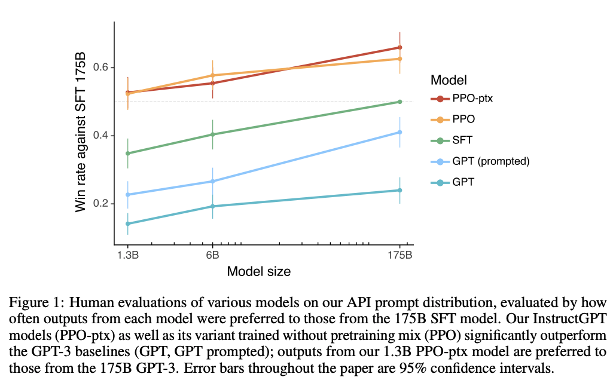
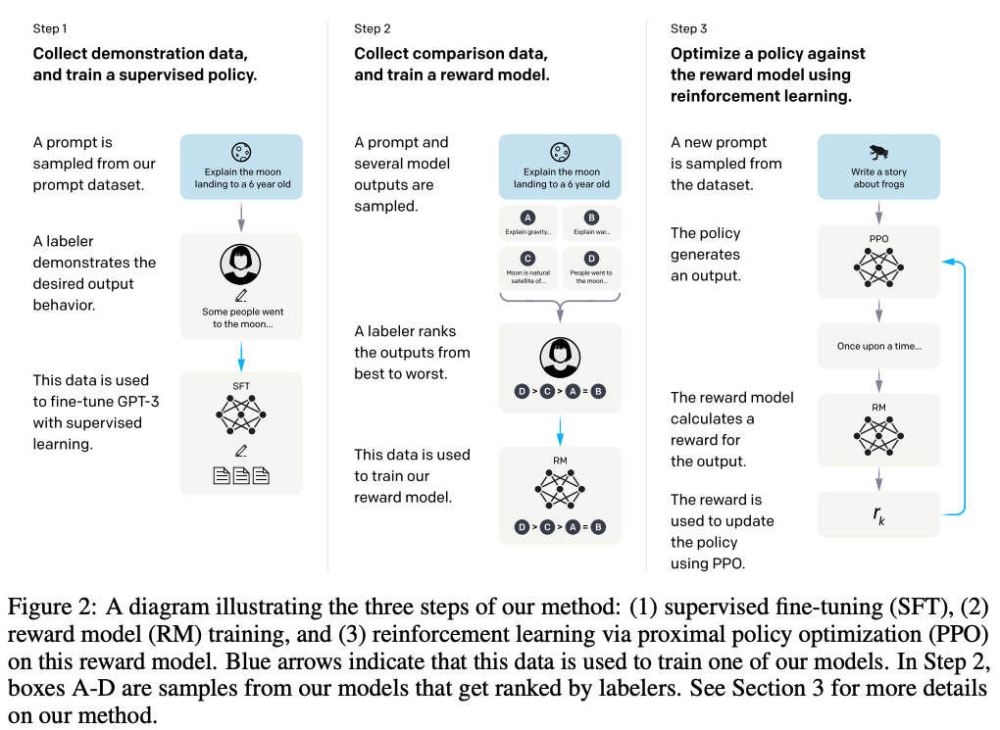

# Training language models to follow instructions with human feedback

## 摘要
将语言模型变得更大并不能本质上使其更擅长追随用户意图。例如，大型语言模型可能生成不真实、有毒或对用户没有帮助的输出。换句话说，这些模型与用户的"对齐"不够。在本文中，我们展示了一种通过使用人类反馈进行微调，从而使语言模型在各种任务上与用户意图对齐的方法。我们从一组由标注者编写的提示和通过OpenAI API提交的提示开始，收集标注者演示所期望的模型行为的数据集，并使用监督学习来对GPT-3进行微调。然后，我们收集了模型输出的排名数据集，并使用来自人类反馈的强化学习进一步微调这个监督模型。我们将得到的模型称为"InstructGPT"。在我们的提示分发的人类评估中，1.3B参数的InstructGPT模型的输出优于175B的GPT-3模型的输出，尽管参数少了100倍。此外，InstructGPT模型在真实性方面有所改进，减少了有毒输出的生成，同时在公共NLP数据集上的性能下降最小。尽管InstructGPT仍然会犯一些简单的错误，但我们的结果表明，使用人类反馈进行微调是实现语言模型与人类意图对齐的一个有希望的方向。

## 1. 简介
大型语言模型（LMs）可以通过输入某些任务的示例来"提示"执行各种自然语言处理（NLP）任务。然而，这些模型经常表现出意外的行为，例如虚构事实，生成带有偏见或有毒的文本，或者简单地不遵循用户的指令。这是因为许多最近的大型语言模型使用的语言建模目标——从互联网上预测下一个网页上的标记——与"遵循用户的指令，并提供有帮助且安全的响应"的目标不同。因此，我们称语言建模目标存在"不对齐"。避免这些意外行为对于在数百个应用程序中部署和使用的语言模型尤为重要。

我们通过训练语言模型按照用户的意图行动（Leike等，2018）来取得了对齐语言模型的进展。这包括明确的意图，如遵循指示，以及隐含的意图，如保持真实，不偏袒，毒性或以其他方式造成伤害。使用Askell等人（2021）的术语，我们希望语言模型具有帮助性（它们应该帮助用户解决问题），诚实（它们不应该捏造信息或误导用户）和无害（它们不应该对人或环境造成身体，心理或社会伤害）。我们在第3.6节详细阐述了对这些标准的评估。

我们专注于微调调语言模型的方法来对齐。具体来说，我们使用基于人类反馈的强化学习（RLHF；Christiano等，2017；Stiennon等，2020）来对GPT-3进行微调，使其能够遵循广泛类别的书面指令（参见图2）。该技术使用人类偏好作为奖励信号来对模型进行微调。我们首先雇用了一个由40名承包商组成的团队，根据他们在筛选测试中的表现为数据打标签（有关详细信息，请参见第3.4节和附录B.1）。然后，我们收集了一个人类编写的示范数据集，其中包含了所期望的输出行为（大多为英文）的提示，这些提示被提交到OpenAI API，还包括一些由标注者编写的提示，并使用这些数据集来训练我们的监督学习基线模型。接下来，我们收集了一个人类标记的数据集，其中包含我们的模型在更大的API提示集上输出的比较结果。然后，我们在该数据集上训练一个奖励模型（RM），以预测标注者更喜欢哪个模型的输出。最后，我们使用这个RM作为奖励函数，并使用PPO算法（Schulman等，2017）来最大化这个奖励来对我们的监督学习基线模型进行微调。我们在图2中说明了这个过程。这个过程将GPT-3的行为与一个特定群体（主要是我们的标注者和研究人员）的陈述偏好对齐，而不是与任何更广泛的“人类价值观”概念对齐；我们在第5.2节进一步讨论了这一点。我们将这些结果模型称为InstructGPT。

我们主要通过让我们的标注者对我们的测试集中的模型输出质量进行评分来评估我们的模型，该测试集由来自训练数据中未包含的客户的提示组成。我们还在一系列公开的自然语言处理数据集上进行自动评估。我们训练了三种模型规模（1.3B、6B和175B个参数），所有的模型都使用了GPT-3的架构。我们的主要发现如下：

**标注者明显更喜欢InstructGPT的输出，而不是来自GPT-3的输出。**在我们的测试集上，虽然InstructGPT模型只有1.3B个参数，但它的输出被更多地偏好于175B GPT-3的输出，尽管参数数量只有后者的1%。这些模型具有相同的架构，唯一的区别是InstructGPT在我们的人工数据上进行了微调。即使我们给GPT-3添加了一些少量的示例提示，以使其更擅长遵循指令，这个结果仍然成立。在175B规模的模型中，InstructGPT的输出在85 ± 3%的情况下被优先选择，而相比于少量示例的175B GPT-3，InstructGPT在71 ± 4%的情况下被优先选择。根据我们的标注者，InstructGPT模型生成的输出更为合适，并更可靠地遵循指令中的明确约束。

**InstructGPT模型在真实性方面相对于GPT-3有所改进。**在TruthfulQA基准测试中，InstructGPT生成的真实且有信息的答案的频率大约是GPT-3的两倍。我们在那些没有针对GPT-3进行对抗选择的问题子集上的结果同样出色。在我们的API提示分布的“封闭领域”任务中，输出不应包含输入中不存在的信息（例如摘要和封闭领域的问答），相比于GPT-3，InstructGPT模型生成的错误信息的频率约为后者的一半（分别为21%和41%的错误信息频率）。

**InstructGPT在有毒性方面相对于GPT-3有轻微改进，但在偏见方面没有改进。**为了衡量有毒性，我们使用了RealToxicityPrompts数据集（Gehman等，2020），并进行了自动和人工评估。当被要求保持尊重时，InstructGPT模型生成的有毒输出比GPT-3少约25%。在Winogender（Rudinger等，2018）和CrowSPairs（Nangia等，2020）数据集上，InstructGPT相对于GPT-3并没有显著改进。

**我们可以通过修改我们的RLHF微调程序来最小化在公开NLP数据集上的性能下降。**在RLHF微调过程中，我们观察到与GPT-3相比在某些公开NLP数据集上的性能下降，特别是SQuAD（Rajpurkar等，2018）、DROP（Dua等，2019）、HellaSwag（Zellers等，2019）和WMT 2015法英翻译（Bojar等，2015）。这是“对齐成本”的一个例子，因为我们的对齐过程会以在我们关心的某些任务上的较低性能为代价。通过将PPO更新与增加预训练分布对数似然的更新（PPO-ptx）相结合，我们可以大大减少这些数据集上的性能下降，而不会影响标注者的偏好分数。

**我们的模型能够推广到未产生任何训练数据的“保留”标注者的偏好上。**为了测试我们模型的泛化能力，我们进行了一项初步实验，与保留的标注者合作，并发现他们与我们的训练标注者一样，更喜欢InstructGPT的输出而不是GPT-3的输出。然而，需要进行更多的工作来研究这些模型在更广泛的用户群体上的表现，以及它们在人们对所期望的行为存在分歧的输入上的表现。

**公开的NLP数据集不能反映我们的语言模型的使用方式。**我们将在我们的人类偏好数据上进行微调的GPT-3（即InstructGPT）与在两种不同的公开NLP任务编译上进行微调的GPT-3进行比较：FLAN（Wei等，2021）和T0（Sanh等，2021）（特别是T0++变种）。这些数据集包括各种NLP任务，每个任务都有相应的自然语言指令。在我们的API提示分布上，我们的FLAN和T0模型的性能略低于我们的SFT基线，并且标注者明显更喜欢InstructGPT而不是这些模型（InstructGPT在与我们基线的对比中具有73.4 ± 2%的胜率，而我们的T0和FLAN版本的胜率分别为26.8 ± 2%和29.8 ± 2%）。

**InstructGPT模型在RLHF细调分布之外的指令上展现出了良好的泛化能力。**我们对InstructGPT的能力进行了定性探索，并发现它能够按照指令进行代码摘要、回答关于代码的问题，并且有时甚至能够遵循其他语言的指令，尽管这些指令在细调分布中非常罕见。相比之下，GPT-3可以执行这些任务，但需要更仔细的提示，并且通常不会在这些领域遵循指令。这个结果令人振奋，因为它表明我们的模型能够泛化“遵循指令”的概念。即使在接受非常少的直接监督信号的任务中，它们仍然保持一定的对齐能力。

**InstructGPT仍然会犯一些简单的错误。**例如，InstructGPT有时无法遵循指令，会虚构事实，对简单问题给出过于模棱两可的答案，或无法识别具有错误前提的指令。

总体而言，我们的结果表明，使用人类偏好对大型语言模型进行细调显著改善了它们在各种任务上的行为，尽管在提高其安全性和可靠性方面仍有许多工作要做。

## 2. 相关工作

**对齐和从人类反馈中学习的研究。**我们构建在先前的技术基础上，以人类意图对齐模型，特别是利用人类反馈进行强化学习（RLHF）。最初用于在模拟环境和Atari游戏中训练简单机器人（Christiano等，2017；Ibarz等，2018），最近已被应用于微调语言模型以进行文本摘要（Ziegler等，2019；Stiennon等，2020；Böhm等，2019；Wu等，2021）。这项工作受到类似工作的影响，这些工作使用人类反馈作为奖励在对话（Jaques等，2019；Yi等，2019；Hancock等，2019）、翻译（Kreutzer等，2018；Bahdanau等，2016）、语义解析（Lawrence和Riezler，2018）、故事生成（Zhou和Xu，2020）、评论生成（Cho等，2018）和证据提取（Perez等，2019）等领域。Madaan等（2022）利用书面人类反馈增强提示，提高了GPT-3的性能。也有关于使用具有规范先验的RL在基于文本的环境中对齐代理的工作（Nahian等，2021）。我们的工作可以看作是将RLHF直接应用于在广泛的语言任务分布中对齐语言模型。

最近，对于语言模型对齐意味着什么的问题也引起了关注（Gabriel，2020）。Kenton等（2021）对由于失调而导致的LM行为问题进行了分类，包括生成有害内容和游戏错误指定的目标。在同时进行的工作中，Askell等（2021）提出语言助手作为对齐研究的试验平台，并研究了一些简单的基线及其扩展性质。

## 3. 方法和实验细节
### 3.1 高级方法学
### 3.2 数据
### 3.3 任务
### 3.4 人类数据收集
### 3.5 模型
### 3.6 评估

## 4. 结果
### 4.1 API分发的结果
### 4.2 公开NLP数据集上的结果
### 4.3 定性结果

## 5. 讨论
### 5.1 对齐研究的影响
### 5.2 我们在向谁对齐
### 5.3 局限
### 5.4 开放性问题
### 5.5 更广泛的影响
